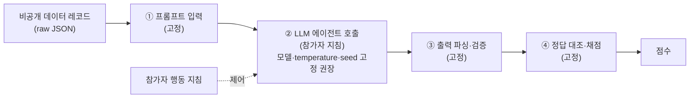
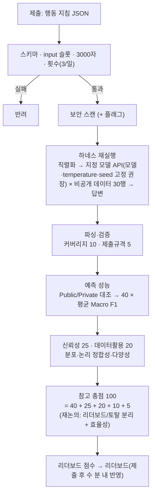

# 출제 후보 04. 설비 정비주기 예측형 — 대회 설계 기획서

## Context (왜 이 문서를 만드는가)

「2026 국방AI 프롬프트 경진대회」(주최 국방부, 주관 IITP/KAIST·데이원컴퍼니)의
**출제 후보 04 — 설비·고장 정비주기 예측형**을 실제 운영 가능한 수준으로 구체화한다.

원 기획안·개발문서(→ `docs/`)에서 미확정으로 남아 있는 항목을 본 문서에서 **설계안**으로 정리한다. 단, 주최측·미송님 확인이 필요한 항목은 별도 표기한다.

1. **라벨 체계·샘플 데이터 미정** — `failure_risk_grade`, `maintenance_cycle_range`의 라벨 값과 예시 규칙을 §1에서 설계한다.
2. **자동채점 기준** — 주최측 공식 자동채점 기준(예측 성능 40·결과 신뢰성 25·데이터 활용역량 20·문제해결 완성도 10·제출규격 5 = 100)을 **참고 기준**으로 반영하되, 7/5 자문단 논의에 따라 **리더보드 점수 / 토탈 점수 분리**와 **프롬프트 효율성 반영 여부**는 미송님 확정이 필요하다.
3. **재실행 하네스** — 참가자는 예측 파일이 아니라 LLM 행동 지침을 제출하고, 서버가 동일한 자동 실행·채점 구조로 재실행해 점수를 산정한다.

**현재 작업 전제:** ① 참가자는 코드·예측 파일이 아닌 행동 지침 프롬프트를 제출, ② 채점은 서버 재실행 하네스 기반, ③ 라벨/데이터는 합성 데이터 기반 설계안으로 제시, ④ 실 데이터 생성·시스템 구현은 데이원컴퍼니 플랫폼 개발팀 담당.

> **문서 성격.** 본 문서는 개발 확정 명세가 아니라, 주최측 의사결정과 개발사 구현 방향을 맞추기 위한 **자문 설계안**이다.

### 참고 레퍼런스 (DACON 벤치마킹)

| 레퍼런스 | 차용 관례 | 반영 |
|---|---|---|
| [**236552**](https://dacon.io/competitions/official/236552/overview/description) — KT K intelligence Track2 (프롬프트 엔지니어링, 4속성 분류) | **한 줄 콤마 동시 출력** + **"하나라도 누락 시 0점"**; **리더보드=예선, 검증 후 본선 확정(2단계)** | §3 출력 계약 · §5 |
| [**236627**](https://dacon.io/competitions/official/236627/overview/description) — 롯데이노베이트 (이진분류) | **평가셋 비공개**; **최고점 자동선택**; 산식 악용·불건전 프롬프트 실격 (채점 산식은 주최측 공식 기준 채택 → §4) | §1.1 · §4 · §5 |
| DACON 분류 공통 | **Macro F1**(불균형 방어), 순서형 QWK; **Public/Private 분할** | §4.2 · §5 |

> **레퍼런스와의 차이:** DACON/AIfactory는 참가자가 *예측 파일*을 올려 채점한다. 본 대회는 참가자가 *행동 지침*을 제출하고 **하네스가 모델을 재실행**해 그 출력을 채점한다 → 하드코딩 원천 차단, 대신 **LLM 비결정성·API 비용** 이슈(§7).

---

## 1. 데이터셋 설계

### 1.1 파일 구성

| 파일 | 라벨 | 공개 | 용도 | 행 수 |
|---|---|---|---|---|
| `sample.csv` | O | **공개** | 참가자가 라벨 규칙을 추론하는 **샘플 데이터** | 15 |
| `private.csv` | 입력만 | **서버 보관·비공개** | 하네스가 참가자 지침을 재실행하는 **비공개 데이터**(채점 대상) | 30 |
| `ground_truth`(내부) | O | **격리** | 채점 워커만 접근하는 정답셋(Public/Private 분할) | 30 |
| `sample_prompt.json` | — | 공개 | 행동 지침 제출 형식 예시 (§3.1) | — |
| `problem_description.md` | — | 공개 | 문제·입력 스키마·라벨 정의·출력 계약·FAQ·보안 유의 | — |

> **재실행 패러다임:** 참가자는 비공개 데이터를 보지 않는다. 샘플 데이터 15행으로 규칙을 추론해 **일반화된 지침**을 쓰고, 하네스가 숨겨진 비공개 데이터에 적용한다. 비공개 데이터의 입력·정답 모두 비공개 → 하드코딩·역추적 불가.

> **행 수 = 설명·프로토타입 검증용 기준.** 위 표의 15행/30행은 **설명·프로토타입 검증용**이다. 실제 운영에서는 리더보드 안정성과 변별력을 위해 private 채점셋을 **최소 100~300행** 수준으로 확장하는 방안을 권장한다. 단, LLM 호출 비용을 고려해 공식 채점은 행별 호출이 아니라 미니배치 또는 일괄 배치 호출로 구현하는 것을 검토한다(§7.1·§8.3).

> **예시 데이터 생성됨(`data/`):** `sample.csv`(15·라벨) · `private.csv`(30·입력만) · `ground_truth.csv`(30·라벨+Public 12/Private 18)를 §1.3 규칙으로 생성(라벨 규칙 위반 0·경계 케이스 포함, seed 고정). **단 §1.3 단순 임계 규칙으로 만든 설명·개발 검증용**이며, 실제 대회 private 셋은 아래 재설계(§1.3 경고) 필요.

### 1.2 입력 컬럼 (`private.csv`/`sample.csv` 공통, 라벨 제외)

장비 유지보수 이력을 모사한 **합성 데이터**(컬럼 분포·용어는 실제 공공데이터 스타일 감수).

> **합성 데이터를 쓰는 이유:** 실제 군 정비 데이터는 보안·반출 이슈가 있어, 정비 업무 구조를 **모사한 합성 데이터**를 쓴다. 군 장비 정비 맥락은 이해되되 **특정 부대·장비·작전 정보는 드러나지 않게** 설계한다. 참고 공공데이터: 한국탄소산업진흥원_장비유지보수정보/장비목록(data.go.kr).

| 컬럼 | 타입 | 설명 | 예시 |
|---|---|---|---|
| `id` | int | 제출 대상 ID | 1 |
| `equipment_type` | str | 장비 유형 | 발전기 / 전술차량 / 통신장비 / 레이더 / 화포 |
| `repair_start_date` | date | 수리 시작일 | 2026-01-05 |
| `repair_end_date` | date | 수리 종료일 | 2026-01-11 |
| `maintenance_action` | str | 정비 조치(자유 텍스트) | "엔진 오일 교환 및 냉각계통 점검" |
| `cost` | int | 투입 비용(원) | 850000 |
| `maintenance_count_1y` | int | 최근 1년 정비 횟수 | 6 |
| `operating_hours` | int | 누적 가동시간 | 4200 |
| `days_since_last_failure` | int | 직전 고장 후 경과일 | 20 |

### 1.3 라벨 정의 (라벨 값 확정안 · 규칙은 설명/검증용)

두 라벨은 상호 연관(위험↑ → 주기↓).

**① `failure_risk_grade` — 고장위험등급 (3단계)**

> 아래 규칙은 설명·개발 검증을 위한 예시다. 실제 private 채점셋의 정답 생성 규칙은 그대로 공개하지 않으며, 변별력 확보를 위해 별도 재설계가 필요하다.

| 값 | 판정 규칙(정답 생성) |
|---|---|
| `HIGH` | 정비 ≥ 5회 **또는** 가동 ≥ 4000h **또는** 직전고장 ≤ 30일 |
| `MEDIUM` | HIGH·LOW 어느 쪽도 아님 |
| `LOW` | 정비 ≤ 2회 **그리고** 가동 < 2000h **그리고** 직전고장 > 90일 |

**② `maintenance_cycle_range` — 다음 정비주기 구간 (4구간, 일)**

| 값 | 규칙 |
|---|---|
| `0-30` | risk=HIGH |
| `31-90` | risk=MEDIUM & 가동 ≥ 3000h |
| `91-180` | risk=MEDIUM & 가동 < 3000h |
| `181+` | risk=LOW |

> 참가자에게 제공되는 문제 설명서에는 **라벨 값과 출력 형식만 공개**하고, 실제 private 채점셋의 **정답 생성 규칙은 참가자에게 공개하지 않는다**(개발·검증 단계에서는 위 설명용 규칙을 사용하되, 실제 운영용 private 규칙은 별도 재설계). 참가자는 샘플 데이터 15행에서 규칙을 **추론**해 지침에 녹인다 = 프롬프트 엔지니어링 역량 평가. 경계 케이스를 배치해 변별.

> ⚠️ **데이터 결함 · 재설계 필요(7/5 미팅):** 현재 규칙은 설명용으로는 적합하지만 실제 출제 규칙으로 사용하기에는 변별력이 부족하다. 참가자가 컬럼 설명과 문제 조건을 그대로 LLM에 입력하면 높은 점수를 받을 가능성이 있으므로, 실제 private 채점셋은 **비선형 조건, 특성 간 상호작용, 경계 사례, 일부 노이즈, 숨긴 임계값**을 포함해 별도로 재설계해야 한다. (열린 결정 ⑤ · §7)

---

## 2. 문제 정의 — 고정 하네스, 참가자 슬롯

**핵심.** 자유 프롬프트 제출이 아니다. 본 대회에서 참가자는 코드나 정답 파일을 제출하지 않고, LLM이 데이터를 어떻게 읽고 판단해야 하는지 설명하는 **행동 지침 프롬프트**를 제출한다. 주최 측은 프롬프트 입력 → 모델 호출 → 출력 파싱 → 정답 대조 → 점수 산정까지 이어지는 **자동 실행·채점 구조(하네스)**를 고정한다.

**경계 = "분석이냐 배관이냐" (전부 고정이 아님):**
- **하네스(고정) = 자동 실행·채점 구조:** 레코드 직렬화 → 지침에 주입 → 모델 호출 → 엄격한 출력 파싱 → 정답 대조 → 채점. **분석 판단은 하지 않음.**
- **행동 지침(참가자) = 모든 분석:** 필드 해석, **전처리·피처 유도**, 추론 단계, 분류, 출력 규율. 예) "먼저 수리기간=종료−시작 계산, 가동시간 정규화 후 분류하라" → 모델이 in-context 수행.

**고정 하네스 파이프라인 (Shape A — 단일 행동 지침형):**

| 단계 | 담당 | 내용 |
|---|---|---|
| 1 | **고정** | 비공개 데이터 레코드를 **raw JSON**으로 직렬화 (파생값 없이 — 파생은 지침이 결정) |
| 2 | **참가자** | **LLM 에이전트 호출** — 지침이 전처리+추론+분류를 지시 · 모델/temperature/출력형식 고정 권장 · 초기 설계는 행당 1회, 운영 전 배치 호출 검토 |
| 3 | **고정** | 출력 파싱·검증 (마지막 `risk_grade, cycle_range` 줄 계약 파싱; 형식 위반·허용값 밖 행 0점) |
| 4 | **고정** | 정답 대조·채점 (Macro F1 · 신뢰성·데이터활용 · 통합 산식 · 원출력 저장) |



- **참가자가 쓰는 것:** 2단계 **행동 지침** 하나 — 전처리 방법 포함.
- **왜 하네스를 고정:** 입력 형식·출력 계약·채점 산식을 주최 측이 고정해 모든 참가자를 동일 조건에서 평가한다. 정답셋과 API 키는 서버 측 채점 워커에만 격리해 하드코딩·우회 가능성을 낮춘다.
- **Shape B (2차 PBL 대회 이관):** 참가자가 단계별 지침을 작성하는 **다단계** 파이프라인(예: 전처리 지침 → 분류 지침, 하네스가 체이닝). 풍부하나 비용과 실패모드가 증가한다. 다만 초급 친화성을 우선하면 Shape B가 더 적합할 수 있어 미송님 결정이 필요하다.

> **현재 본 문서는 Shape A를 기준으로 작성한다.** 단, 미송님 확인 결과 Shape B가 채택될 경우 **제출 스키마·하네스 호출 구조·채점 파이프라인·UI가 모두 변경**된다(열린 결정 ④ · §7.0·§7.1).

| 항목 | Shape A | Shape B |
|---|---|---|
| 참가자 제출 | 행동 지침 1개 | 전처리·분석·출력 지침 3개 |
| LLM 호출 | 단일 호출 또는 행별 호출 | 단계별 다중 호출 |
| 난이도 | 중간 | 초급 친화 |
| 비용 | 낮음 | 높음 |
| UI | 단일 프롬프트 입력창 | 단계별 입력 UI |
| 채점 안정성 | 단순 | 실패 지점 증가 |

---

## 3. 제출 형식

### 3.1 행동 지침 제출 스키마 (`submission.json`)

참가자는 예측 파일이 아니라 **행동 지침**을 제출한다. 하네스 주입 자리 `{{input}}`을 포함하고, 지정 출력 계약으로 답하도록 지시해야 한다.

```json
{
  "instruction": "너는 국방 설비 정비 분석가다. 아래 정비 이력의 고장위험등급과 다음 정비주기 구간을 분류하라.\n입력:\n{{input}}\n출력은 반드시 `<risk_grade>, <cycle_range>` 한 줄로만. risk_grade∈{HIGH,MEDIUM,LOW}, cycle_range∈{0-30,31-90,91-180,181+}.",
  "memo": "선택: 접근 방식 요약"
}
```

- **주입:** 하네스가 비공개 데이터 각 행을 `{{input}}`에 삽입해 모델 호출.
- **출력 계약(236552):** 행당 `risk_grade, cycle_range` 콤마 한 줄. 하네스가 파싱.
- **누락 규칙(236552):** 파싱된 두 라벨 중 하나라도 비거나 허용 밖이면 해당 행 정확도 0점.

### 3.2 지침 제약

- **하드 캡: 3000자** 초과 시 제출 반려(폼 실시간 카운터, payload·비용 보호).
- `{{input}}` 누락·스키마 위반 → 반려(횟수 미차감).

---

## 4. 자동채점 설계안 — 배점은 미송님 확정 필요

> ⚠️ **재논의 중 (7/5 자문단 미팅) · 배점 미확정 · 미송 결정.** 채점은 **리더보드 점수 / 토탈 점수 분리**로 재구성됐다:
> - **리더보드 점수**(실시간 경쟁, 최고점 자동 선택) = 결과값 유효성(예측 정확성·Macro F1) + **프롬프트 효율성**(글자·토큰).
> - **토탈 점수**(최종·수상) = 리더보드 점수 + 온라인 수강률 + 제출형식 준수 + 보안 적합성.
>
> 정확 배점은 **대회 의도·문제 수(1 vs 4)** 확정 후(§7). 아래 §4.1~4.5(IITP 공식 5-dim)는 **참고 기준**이며, 프롬프트 효율성 재도입·분리 반영은 미송 확정 후 개정.

### 4.1 참고 배점안: IITP 공식 5개 항목 기준

> **아래 배점표는 개발사가 채점 구조를 이해하기 위한 참고안이며, 최종 구현 배점은 미송님 확인 후 확정한다.** 특히 리더보드 점수와 토탈 점수를 분리할 경우, 아래 100점 구조는 그대로 적용되지 않을 수 있다.

주최측 공식 자동채점 기준(예측 성능·결과 신뢰성·데이터 활용역량·문제해결 완성도·제출규격)을 참고 기준으로 둔다. 채점 대상은 **하네스가 재실행한 모델 출력**(재실행 패러다임 유지 — 예측 파일 업로드 아님). 다만 7/5 자문단 논의 기준으로는 수강률·제출형식·보안 적합성을 토탈 점수에 포함할지 또는 게이트로 둘지 최종 확인이 필요하다.

| 평가 방향 | 평가항목 | 배점 | 채점 정의 |
|---|---|---:|---|
| 예측 성능 | 정비주기 예측 정확성 | **40** | `40 × 평균 Macro F1` (risk 3-class·cycle 4-class 평균) (§4.2) |
| 결과 신뢰성 | 예측결과 신뢰성 | **25** | 정답 없이 판정 — 분포 건전성(단일 라벨 과쏠림 방지) + `risk↔cycle` 논리 정합성 (§4.3) |
| 데이터 처리 역량 | 데이터 활용역량 | **20** | 정답 라벨 분포 근접도 + 클래스 다양성(엔트로피) (§4.3) |
| 문제 해결 | 문제해결 완성도 | **10** | 커버리지 — 비공개 데이터 30행 전부 유효 예측 비율 (§4.4) |
| 제출 적합성 | 제출규격 준수 | **5** | 출력 계약(한 줄·콤마·허용 라벨) 파싱 적합률 (§4.4) |
| | **합계** | **100** | |

> **범주형 적응(중요):** 공식 문구(음수값·이상치·범위·수요예측)는 수치예측 기준이라 우리 범주형 라벨(위험등급·주기구간)에는 그대로 적용되지 않는다. 신뢰성·데이터활용을 **범주형용으로 재해석**한다(§4.3). 세부 상수(과쏠림 임계·하위가중)는 잠정, 전문위원 협의(§7).

> **엄밀 플래그:** 정확도 40/100 · 출력 건전성(신뢰성+데이터활용) 45/100. 정확도 비중이 절반 이하라 **그럴듯하지만 틀린 출력**이 상대적으로 높게 나올 수 있다(§9 B=70.0). 정확도 우선을 강화하려면 예측 성능 가중 상향 협의(§7).

### 4.2 예측 성능 — 평균 Macro F1 (40점)

- `failure_risk_grade`(명목형 3-class): **Macro F1**(클래스별 F1 평균).
- `maintenance_cycle_range`(순서형 4-class): **Macro F1(기본)** vs **QWK / MAE·RMSE**(공식 구현기준 병기) 협의(§7).
- `평균 F1 = (F1_risk + F1_cycle)/2` (0~1) → `40 × 평균 F1`.
- 하네스가 모델 출력을 라벨로 파싱; 파싱 실패·허용 밖은 오분류.
- **Public/Private:** 비공개 데이터 30행 = Public 12 / Private 18. 대회 중 Public, 최종 Private 재채점 → 역추적·과적합 차단.

### 4.3 결과 신뢰성(25)·데이터 활용역량(20) — 범주형 재해석

정답 없이도 판정 가능한 **출력 품질** 지표. 신뢰성=하방 방어(감점), 데이터활용=상방 보상 — 경계를 분리해 이중감점을 피한다.

| 항목 | 만점 기준 | 감점/측정 |
|---|---|---|
| 결과 신뢰성 (25) | 단일 라벨 과쏠림 없음 + `risk↔cycle` 논리 정합 | ⓐ 한 라벨이 임계(잠정 80%) 초과 점유 → 분포 건전성 감점 · ⓑ §1.3 상관 위반 쌍(예: HIGH↔181+) 비율 → 논리 정합성 감점 |
| 데이터 활용역량 (20) | 정답 분포에 가까운 다양성 | 정답 라벨 분포 대비 출력 분포 근접도 + 클래스 다양성(엔트로피). "모든 입력에 같은 답"은 0점대 |

- `risk↔cycle` 논리 정합성은 §1.3 라벨이 결정론적으로 연결(위험↑→주기↓)되므로 **정답 없이 측정 가능** — 범주형에 강력.
- 임계·가중은 잠정(§7). 회귀 골드셋(§9)으로 기대값 고정.

### 4.4 문제해결 완성도(10)·제출규격 준수(5) — 파싱 기준

| 항목 | 만점 | 감점 |
|---|---|---|
| 문제해결 완성도 (10·커버리지) | 30행 전부 유효 예측(빠짐·빈값 0) | 무응답·파싱 실패 행당 차감 (하한 0) |
| 제출규격 준수 (5) | 출력 계약(한 줄·콤마·허용 라벨) 전행 준수 | 계약 이탈·허용 밖 형식 행당 차감 |

### 4.5 게이트 (점수 밖)

- **수강률:** 필수 VOD 3개 각 30%↑ 미충족 → 문제 열람·제출 차단(응시 자격). 점수화하지 않음.
- **보안:** 지침·모델 출력 내 개인정보·군 보안 표현·금지어 매칭 → `review_flags` + 실격/부정 사유. 점수화하지 않음.
- **제출 제약:** 지침 3000자 하드캡 초과 → 반려(payload·비용). 위 IITP 참고안 기준에서는 **간결성을 채점하지 않는다**(공식 기준에 없음). ⚠️ 단, §4 배너의 리더보드/토탈 분리안은 **프롬프트 효율성(글자·토큰)을 리더보드 점수에 재도입**하는 방향이라 이 항목과 상충 — 효율성 반영 여부는 미송 확정 사항(열린 결정 ③ · §7.0).

---

## 5. 리더보드 + 2단계 심사 (예선 → 검증 → 수상)

- **표시:** 순위 / 참가자명(마스킹) / 소속(공개토글) / **리더보드 점수**(결과값 유효성·프롬프트 효율성) / **제출 횟수** / 최종 제출시간. **토탈 점수(+수강·형식·보안)·최종 순위는 별도 공지.**
- **참가자 본인 뷰:** 자기 순위 + **상위 백분위(예: 상위 12%)** + **점수 분포 그래프의 본인 위치**.
- **점수 소스:** 대회 중 Public(12), 마감 후 Private(18) 최종.
- **공개 방식:** 제출 후 **통상 수 분 내(최대 15분) 반영**(접수 확인 → 백그라운드 채점) + 단계적 공개(초반 구간 → 진행 갱신 → 마지막날 등수 → 마감 후 최종). 순수 자정 배치는 완화(군 취침시간 고려). 상세는 `system_functional_spec.md` §6.
- **최고점 자동 선택**(롯데).
- **2단계 심사(KT):** ① 예선=자동 리더보드(Private 재채점) → ② 검증=상위권 보안·표절·산식 악용 검수 후 수상 확정(탈락 시 차순위 승계).
- **동점(공식 순서):** ① 예측 성능 점수 → ② Private Test 성능 → ③ **최초** 제출시간.
- **부정 방지:** 1일 3회 상한 · 유사 지침 탐지 · Private·정답셋 비공개 · 산식 악용 실격 · 재실행이 하드코딩 무력화.

---

## 6. 채점 파이프라인 (구현 참고)



---

## 7. 미확정·협의 항목

### 7.0 열린 결정 — 미송 논의 (7/5 미팅, 상위 결정)

1. **대회 의도** — LLM 활용 능력 향상(경쟁) vs 다양한 활용 경험. 문제 수·채점·난이도가 종속.
2. **문제 수·채점** — 출제 후보 4개(조달 수요예측·입영 수요예측·드론 탐지·정비주기). 전부/일부/1개? 점수=합/평균/최고점? 문제별 난이도 배점? *본 문서는 출제 후보 04 인스턴스; 하네스는 `competitions` 테이블로 다문제 재사용(→ `dev_architecture_plan.md`).* leaning: 일부 선택 + 문제별 배점(참여 유도).
3. **리더보드/토탈 배점** — 분리 구조(§4 배너)의 각 항목 정확 배점 + 프롬프트 효율성 계산식. *leaning: 프롬프트 효율성은 결과 성능이 일정 수준 이상일 때만 **보조 지표**(동점 처리 또는 소배점 5~10점) — 무조건 짧게 써서 성능이 낮아지는 역효과 방지, 결과값 유효성을 1차 기준으로.*
4. **제출 형태** — 단일 지침(Shape A) vs 가이드형 다단계(노드별 프롬프트, Shape B — 주최측 Data_Sample). leaning: 초급 친화 Shape B.
5. **데이터 결함** — §1.3 규칙 LLM-추론 위험 → 재설계(§1.3 경고).

**미팅 반영 제약(확정):** 모바일 우선 + 세션 지속 · 제출 후 통상 수 분 내(최대 15분) 반영 · 부정 방지(함정+지인 QA) · 스택 비강제(API 병목·배치) · non-reasoning 소형 모델 + 정답-only 출력.

### 7.1 기술 협의 항목

1. **채점 모델** — 경량 모델 우선 검토(예: `gpt-4.1-nano`, 대안 gpt-4o-mini). 실제 운영 모델은 비용·속도·응답 안정성 테스트 후 확정. 상세·비용 → `dev_workplan_scoring_leaderboard.md`
2. **재현성** — 모델 버전·temperature·seed·출력 형식 고정. 완전한 결정론 보장보다는 원출력·파싱 결과·채점 결과 저장으로 검증 기준 확보
3. **API 예산·레이트리밋** — 공식 제출만 단순 계산 시 `1만×3×30 = 90만 호출/일` 가능. 행당 1회 호출은 비용 리스크가 크므로 5~10행 미니배치 또는 30행 일괄 호출 비교 검토 필요
4. **출력 파싱** — 계약 이탈 시 재시도/부분 파싱
5. **입력 주입** — `{{input}}` 치환 vs system/user 분리
6. **채점 가중** — 공식 40/25/20/10/5(채택) vs 예측 성능 상향(정확도 우선 강화). 정확도 40/100 특성(§9 B=70.0) 검토
7. **순서형 metric** — Macro F1(기본) vs QWK vs MAE·RMSE(공식 구현기준 병기)
8. **채점 세부 상수** — 신뢰성 과쏠림 임계(잠정 80%)·하위가중, 커버리지/규격 차감 스케일. 지침 3000자 캡(확정·반려 기준)
9. **비공개 데이터 문항 수** — 현재 30행은 설명·검증용 최소 구조. 실제 운영 시 리더보드 안정성을 위해 100~300행 확장도 검토하되, 비용과 배치 채점 구조를 함께 고려
10. **미리보기 정책** — 횟수(~50/일)·샘플 데이터 행 수(~5)·캐싱
11. **파이프라인 형태** — 단일 호출(Shape A·현재) vs 다단계(Shape B). ⚠️ **재검토:** 주최측 `Data_Sample`(조달 예시)이 **노드1 전처리 → 노드2 분석·분류 → 노드3 구조화(참가자 프롬프트 3개) + rationale LLM-as-Judge**를 기본 구조로 제시 → Shape B가 공식 기본일 수 있어 구조 정합성 결정 필요

---

## 8. 개발사 전달 시 추가 명시 필요 항목

### 8.1 관리자 기능

개발사는 참가자 화면뿐 아니라 운영자가 채점·리더보드·이상 제출을 관리할 수 있는 관리자 화면을 구현해야 한다.

필수 기능 예시는 다음과 같다.

- 참가자 목록 조회: 이름, 소속, 팀/개인 여부, 수강률, 제출 횟수, 최종 점수
- 제출 내역 조회: 제출 시각, 문제, 프롬프트, 모델 원출력, 파싱 결과, 점수
- 재채점 기능: 특정 제출 재채점, 전체 일괄 재채점, 채점 기준 변경 시 재산정
- 리더보드 관리: 구간 공개/등수 공개 전환, 특정 제출 제외 처리
- 이상 제출 탐지: 금지어, 개인정보, 지나치게 유사한 프롬프트, 비정상 반복 제출
- 운영 로그: API 호출량, 토큰 사용량, 실패율, 큐 대기 시간, 채점 오류 내역

### 8.2 보안·부정행위 대응

국방 AI 대회 특성상 실제 군사정보, 개인정보, 부대 정보가 프롬프트나 LLM 질문 도우미에 입력되지 않도록 정책과 필터링이 필요하다.

- private 데이터·정답셋·API 키는 채점 워커 전용 저장소에서만 접근
- 실제 부대명, 작전 정보, 개인정보 입력 금지 안내
- 금지어·개인정보 탐지 시 관리자 검토 플래그 생성
- 동일·유사 프롬프트 대량 제출 탐지
- LLM 질문 도우미 사용 로그 저장 및 이상 사용 탐지
- 산식 악용, 정답 유출, 자동화된 반복 제출 의심 시 실격 또는 관리자 검토

### 8.3 비용·호출량 산정

현재 설계는 이해를 돕기 위해 행당 1회 호출을 기준으로 설명했지만, 실제 운영에서는 비용 절감과 처리 안정성을 위해 배치 호출을 반드시 비교해야 한다.

예상 공식 제출 호출량의 단순 상한은 다음과 같다.

```text
참가자 10,000명 × 1일 공식 제출 3회 × private 30행
= 최대 900,000회 호출/일
```

따라서 실제 개발 시 아래 방안을 비교한다.

1. 행당 1회 호출: 구현은 단순하나 비용·처리량 부담이 큼
2. 5~10행 미니배치 호출: 비용과 파싱 안정성의 절충안
3. 30행 일괄 호출: 비용은 낮으나 출력 파싱 실패 시 리스크가 큼
4. 샘플 실행은 일부 행만 실행하고, 공식 제출은 큐 기반 비동기 채점
5. 일별 예산 상한과 사용자별 rate limit 적용


---

## 9. 검증 (기획서 자체)

> ⚠️ **잠정 · 배점 확정 시 재계산.** 아래는 IITP 공식 5-dim 가정 예시다. 리더보드/토탈 분리 + 프롬프트 효율성 재도입(§4 배너)이 확정되면 골드셋을 새 배점으로 재계산한다. 이 숫자를 최종 회귀 앵커로 고정하지 말 것.

가상 제출 3건 손채점으로 산식 확인. 총점 = 예측성능 + 신뢰성 + 데이터활용 + 커버리지 + 규격 (수강·보안은 게이트, 점수 밖).

| 시나리오 | 예측성능(40) | 신뢰성(25) | 데이터활용(20) | 커버리지(10) | 규격(5) | 총점(100) | 검증 |
|---|---:|---:|---:|---:|---:|---:|---|
| A. 정확·건전 (F1 0.90) | 36.0 | 25 | 20 | 10 | 5 | **96.0** | 이상적 최상위 |
| B. 그럴듯하나 오답 (F1 0.30) | 12.0 | 25 | 18 | 10 | 5 | **70.0** | 형식·분포는 좋으나 정확도 낮음 → 정확도 40 비중의 특성 노출 |
| C. 계약 이탈·저커버리지 (F1 0.15) | 6.0 | 8 | 5 | 4 | 2 | **25.0** | 파싱 실패가 전 항목 잠식 |

→ A(96.0)와 B(70.0)의 차 **26.0점**은 대부분 예측 성능(36.0−12.0=24.0)에서 발생 = 정확도가 최대 단일 항목. 단 B가 70.0에 이르는 것은 정확도 비중이 40/100이기 때문 → 정확도 우선 강화 시 §7 협의.

구현 단계(데이원컴퍼니 팀)에서 최종 확정 산식을 채점 서비스로 옮긴 뒤, 위와 같은 골드셋을 실제 재실행·채점해 기대 총점과 일치하는지 회귀 테스트로 고정한다.
