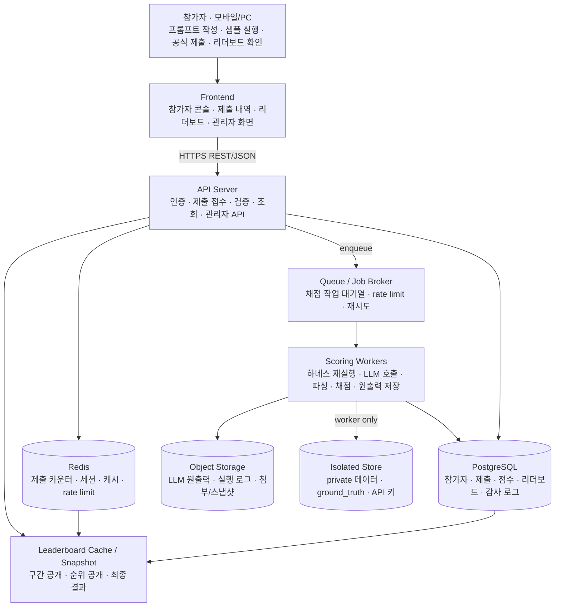

# 개발 아키텍처 계획 — 프로토타입 → 프로덕션 (Front / Back / DB)

> **목적.** 본 문서는 「2026 국방AI 프롬프트 경진대회」의 자동채점·리더보드 시스템을 실제로 구현하기 위한 **개발 아키텍처 계획안**이다.  
> `competition_design_brief.md`가 “무엇을 평가할 것인가(WHAT)”를 정의한다면, 본 문서는 이를 운영 가능한 시스템으로 만들기 위해 **어떤 구조로 구현할 것인가(INFRA/ARCH)**를 설명한다.
>
> 관련 문서:
> - `competition_design_brief.md`: 대회 설계 기준, 문제·데이터셋·채점 방향
> - `system_functional_spec.md`: 사용자/관리자 기능 명세
> - `dev_workplan_scoring_leaderboard.md`: 채점 엔진·리더보드 구현 작업 지시서

---

## 0. 문서 성격과 전제

본 문서는 개발 확정 명세가 아니라, 개발사가 구현 방향을 잡을 수 있도록 제공하는 **권장 아키텍처 계획안**이다.

최종 구현 스택은 데이원컴퍼니 플랫폼 개발팀의 기존 기술 스택, 스킬플로 연동 방식, 국방 보안 요건, 예산, 운영 일정에 따라 조정될 수 있다.

다만 아래 구조는 가급적 유지하는 것을 권장한다.

1. **제출 접수와 채점 실행 분리**
2. **비공개 정답셋과 API 키 격리**
3. **비동기 큐 기반 채점**
4. **제출·원출력·파싱결과·점수 저장**
5. **리더보드 캐싱 및 단계적 공개**
6. **관리자 재채점·검수 기능**
7. **모바일 우선 및 세션 지속**

---

## 1. 설계 원칙

### 1.1 DB 먼저

스키마가 시스템의 뼈대다.  
참가자, 문제, 제출, 모델 실행, 채점 결과, 리더보드, 관리자 검수, 보안 플래그가 모두 DB에서 연결된다.

따라서 초기 개발 단계에서 다음을 먼저 확정한다.

- 참가자 식별 방식
- 문제/회차 구조
- 제출 데이터 구조
- 비공개 정답셋 격리 방식
- 채점 결과 저장 구조
- 리더보드 스냅샷 구조
- 관리자 검수 로그 구조

### 1.2 채점은 비동기

LLM 재실행은 느리고 비용이 발생한다.  
따라서 참가자가 제출 버튼을 눌렀을 때 웹 서버가 즉시 모든 채점을 수행하면 안 된다.

권장 흐름은 다음과 같다.

1. API 서버가 제출 형식과 횟수 제한을 빠르게 검증
2. 제출을 DB에 저장
3. 채점 작업을 Queue에 등록
4. Scoring Worker가 백그라운드에서 LLM 실행 및 채점
5. 채점 완료 후 점수 저장 및 리더보드 반영

이 구조를 통해 마감 직전 제출이 몰려도 웹 접수는 안정적으로 유지할 수 있다.

### 1.3 확장 가능하게 추상화

이번 문서는 `출제 후보 04. K-511 계통별 정비주기 예측형`을 기준으로 작성하지만, 최종 대회에서는 4개 문제 또는 다회차 운영 가능성이 있다.

따라서 문제·모델·하네스·채점 지표는 하드코딩하지 않고 데이터 또는 플러그인 구조로 관리한다.

확장 대상은 다음과 같다.

- 1개 문제 → 4개 문제
- 단일 행동 지침형 Shape A → 단계별 가이드형 Shape B
- Macro F1 → QWK, Accuracy, 규칙 기반 점수 등
- 단일 모델 → 모델 교체 또는 A/B 테스트
- 예선 → 본선 → 2차 PBL형 대회

### 1.4 비용은 1급 관심사

참가자 1만 명, 공식 제출 1일 3회, private 데이터 1000행(Public 300 / Private 700)을 행별 호출하면 단순 상한으로 하루 최대 3천만 회 호출이 발생할 수 있다.

따라서 처음부터 다음 구조를 고려해야 한다.

- 사용자별 미리보기/제출 횟수 제한
- Queue 기반 순차 채점
- 미니배치 또는 일괄 배치 호출
- LLM 호출 예산 상한
- 모델별 비용 추적
- 캐싱 가능 구간 검토
- 채점 실패 및 재시도 정책

---

## 2. 전체 아키텍처



### 핵심 구조

- **Frontend**는 참가자와 관리자가 사용하는 화면을 제공한다.
- **API Server**는 인증, 제출 접수, 검증, 조회를 담당한다.
- **Queue**는 채점 작업을 비동기로 쌓아 둔다.
- **Scoring Worker**는 LLM 재실행, 출력 파싱, 점수 산정, 원출력 저장을 담당한다.
- **PostgreSQL**은 정규 데이터의 기준 저장소다.
- **Redis**는 세션, 제출 횟수 제한, rate limit, 리더보드 캐시에 사용한다.
- **Object Storage**는 LLM 원출력과 대용량 실행 로그를 저장한다.
- **Isolated Store**는 private 데이터, ground_truth, API 키를 격리 저장한다.

---

## 3. 필수 구현과 선택 구현

### 3.1 필수 구현

아래 항목은 기술 스택과 무관하게 반드시 필요하다.

| 구분 | 필수 항목 | 이유 |
|---|---|---|
| 제출 | 공식 제출 저장 | 이의제기·재채점·감사 대응 |
| 검증 | 3000자 제한, `{{input}}` 포함 여부, 스키마 검증 | 비용·채점 실패 방지 |
| 제한 | 1일 제출 횟수 제한, 미리보기 제한 | 비용 통제 |
| 채점 | 비동기 Queue + Worker | 접수 안정성 확보 |
| 보안 | private 데이터·ground_truth 격리 | 정답 유출 방지 |
| 저장 | LLM 원출력·파싱결과·점수 저장 | 재현·감사·이의제기 대응 |
| 리더보드 | 점수 캐시 및 스냅샷 | 조회 부하 방지 |
| 관리자 | 제출 조회·재채점·리더보드 관리 | 운영 필수 |
| 로그 | API 호출량·토큰·실패율·큐 대기시간 | 비용·장애 대응 |

### 3.2 선택 구현

아래 항목은 일정·예산에 따라 단계적으로 도입할 수 있다.

| 구분 | 선택 항목 | 기대 효과 |
|---|---|---|
| 비용 | Batch API 또는 대량 비동기 처리 | 비용 절감 가능 |
| 비용 | 동일 지침 중복 탐지/캐싱 | 반복 호출 감소 |
| UX | LLM 질문 도우미 | 초급자 학습 지원 |
| UX | 자동 저장 및 기기 간 복원 | 군 장병 사용 환경 대응 |
| 운영 | 이상 제출 탐지 | 부정행위 방지 |
| 운영 | 리더보드 단계 공개 | 과열·이탈 방지 |
| 확장 | Shape B 다단계 하네스 | 초급 친화형 문제 운영 |
| 확장 | 다회차/다문제 관리 | 향후 확장성 확보 |

---

## 4. DB 설계

### 4.1 권장 DB 구성

- **PostgreSQL**: 관계형 데이터 기준 저장소
- **Redis**: 세션, 제출 카운터, rate limit, 캐시
- **Object Storage**: LLM 원출력, 실행 로그, 대용량 결과 저장
- **Isolated Store**: private 데이터, ground_truth, API 키

### 4.2 핵심 테이블

| 테이블 | 역할 | 비고 |
|---|---|---|
| `competitions` | 대회 회차·문제·기간·모델·채점 규칙 관리 | 다회차/다문제 확장 기준 |
| `participants` | 참가자 정보·인증·소속·동의 | 구글 계정 기반 가능 |
| `vod_progress` | skillflo 수강률 | 응시 자격 게이트 |
| `problems` | 문제별 데이터셋·라벨·출력 계약 | 4개 문제 확장 대비 |
| `submissions` | 참가자 제출 원문, 상태, 글자 수, 제출 시각 | 공식 제출 기준 |
| `preview_runs` | 샘플 실행 기록 | 비용·횟수 관리 |
| `scoring_jobs` | 큐 작업 상태 | pending/running/succeeded/failed |
| `model_runs` | LLM 실행 메타, 원출력 참조 | 원출력은 Object Storage 권장 |
| `parsed_outputs` | 파싱된 라벨 결과 | 행 단위 결과 |
| `scores` | 항목별 점수, 리더보드 점수, 토탈 점수 | 배점 변경 가능성 고려 |
| `ground_truth` | 정답 데이터 | 별도 스키마/DB, 워커만 접근 |
| `leaderboard_snapshots` | 순위, 백분위, 구간, 공개 상태 | 단계적 공개 |
| `review_flags` | 보안·유사 프롬프트·금지어 플래그 | 관리자 검수 |
| `audit_log` | 관리자 조작, 재채점, 설정 변경 로그 | 감사 대응 |
| `api_budget` | 모델별 호출량, 토큰, 비용 추정 | 예산 관리 |

### 4.3 DB 작업 원칙

- 마이그레이션은 버전 관리한다.
- `ground_truth`는 별도 스키마 또는 별도 DB로 격리한다.
- 웹 API 계정은 `ground_truth`에 접근할 수 없어야 한다.
- 워커 서비스 계정만 private 데이터와 정답셋에 접근한다.
- LLM 원출력은 DB에 직접 대량 저장하기보다 Object Storage에 저장하고 DB에는 경로와 메타데이터를 둔다.
- 리더보드 조회는 Redis 캐시와 스냅샷 테이블로 처리해 무거운 조인을 피한다.
- 제출 횟수 제한은 Redis 원자 연산으로 처리하되, 최종 제출 기록은 DB에 남긴다.

---

## 5. 백엔드 아키텍처

### 5.1 API Server

API Server는 사용자 요청을 받는 무상태 서비스로 구성한다.

주요 책임은 다음과 같다.

- 로그인/인증
- VOD 수강 상태 확인
- 문제 조회
- 샘플 실행 요청
- 공식 제출 접수
- 제출 형식 검증
- 제출 횟수 제한 확인
- 제출 내역 조회
- 리더보드 조회
- 관리자 API 제공

### 5.2 Scoring Worker

Scoring Worker는 Queue에서 작업을 가져와 실제 채점을 수행한다.

주요 책임은 다음과 같다.

1. 제출된 행동 지침 조회
2. private 데이터 로드
3. 하네스에 따라 입력 직렬화
4. LLM 호출
5. 출력 파싱
6. 형식 검증
7. 정답 대조
8. 점수 산정
9. 원출력 저장
10. 리더보드 반영

### 5.3 Preview 경로

샘플 실행/미리보기는 공식 채점과 분리한다.

- 공개 샘플 데이터 일부만 사용한다.
- 결과는 공식 점수가 아님을 명시한다.
- 미리보기 횟수는 1일 약 50회로 제한한다.
- 비용이 커질 경우 Preview Worker를 별도 분리한다.
- 동일 프롬프트와 동일 샘플 입력의 반복 실행은 캐싱을 검토한다.

### 5.4 관리자 API

관리자 API는 운영자가 대회 현황을 관리하기 위한 기능을 제공한다.

- 참가자 목록 조회
- 제출 내역 조회
- 특정 제출 재채점
- 전체 제출 일괄 재채점
- 리더보드 공개 방식 변경
- 보안/금지어 플래그 검토
- 특정 제출 제외 처리
- API 호출량/토큰 사용량 조회
- 큐 대기 시간 및 실패율 모니터링

---

## 6. 프론트엔드 아키텍처

### 6.1 참가자 화면

참가자 화면은 모바일 우선을 기준으로 설계한다.

필수 화면은 다음과 같다.

1. 대회 안내
2. VOD 수강 상태 확인
3. 문제 목록
4. 문제 상세
5. 프롬프트 제출 페이지
6. 샘플 실행 결과
7. 공식 제출 내역
8. 리더보드
9. 내 순위/백분위 확인

### 6.2 프롬프트 제출 페이지

프롬프트 제출 페이지는 코딩 테스트 UI와 유사한 구조가 적합하다.

권장 구성은 다음과 같다.

- 왼쪽: 진행 안내, 문제 설명, 데이터 컬럼 설명, 유의 사항
- 중앙: 행동 지침 프롬프트 작성 영역
- 오른쪽: LLM 질문 도우미
- 하단 또는 별도 탭: 샘플 실행 결과 / 미리보기 결과
- 상단 또는 버튼 영역: 미리보기 잔여 횟수, 제출 잔여 횟수, 글자 수 카운터
- 유의 사항 아래: 리더보드 반영 안내

### 6.3 LLM 질문 도우미

LLM 질문 도우미는 선택 구현이지만, 초급자 대상 경진대회라면 유용하다.

역할은 다음과 같다.

- VOD에서 배운 개념 설명
- 데이터 컬럼 의미 설명
- 출력 형식 안내
- 프롬프트 작성 방향 조언
- Macro F1 등 평가 지표 설명

제한이 필요한 질문은 다음과 같다.

- 정답 프롬프트 작성 요청
- private 데이터 예측 요청
- 채점 규칙 역추론 요청
- 대회와 무관한 일반 질문
- 실제 군사정보 또는 개인정보 입력

모든 질문과 답변은 운영 로그로 저장하고, 토큰 사용량을 기록한다.

### 6.4 관리자 화면

관리자 화면은 별도 권한으로 접근한다.

필수 화면은 다음과 같다.

- 참가자 현황
- 제출 현황
- 채점 작업 현황
- 리더보드 관리
- 이상 제출/보안 플래그
- 재채점 관리
- API 비용/토큰 사용량
- 로그 다운로드

---

## 7. 채점 하네스 형태

### 7.1 Shape A — 단일 행동 지침형

Shape A는 참가자가 하나의 행동 지침 프롬프트를 제출하는 방식이다.

장점:

- 구현이 단순하다.
- 채점 비용이 상대적으로 낮다.
- 제출 스키마가 명확하다.
- 리더보드 운영이 쉽다.

단점:

- 초급자가 문제 해결 과정을 구조화하기 어렵다.
- 한 번의 프롬프트에 전처리, 추론, 출력 형식을 모두 담아야 한다.
- 프롬프트 실패 시 원인 분석이 어렵다.

### 7.2 Shape B — 가이드형 다단계 하네스

Shape B는 참가자가 단계별 프롬프트를 작성하는 방식이다.

예시:

1. 데이터 이해/전처리 지침
2. 판단 기준/분류 지침
3. 출력 구조화 지침

장점:

- 초급자에게 더 친화적이다.
- 문제 해결 과정을 단계별로 학습할 수 있다.
- 각 단계별 실패 원인을 파악하기 쉽다.
- PBL형 또는 2차 대회로 확장하기 좋다.

단점:

- LLM 호출 수와 비용이 증가한다.
- 단계 간 출력 전달 실패 가능성이 있다.
- UI와 채점 파이프라인이 복잡해진다.
- 리더보드 점수 산식이 복잡해질 수 있다.

### 7.3 결정 필요

현재 아키텍처는 Shape A를 기본으로 설명하되, `steps=[serialize, run, parse, score]` 구조를 확장해 Shape B까지 수용할 수 있도록 설계한다.

최종 형태는 주최측이 아래 기준으로 결정한다.

- 대회 목적이 프롬프트 실력 평가인지
- 초급자 체험 중심인지
- API 비용을 어느 정도 허용할 수 있는지
- 문제를 1개만 운영할지, 4개를 운영할지
- UI를 단순하게 갈지, 단계형으로 갈지

---

## 8. 리더보드 아키텍처

### 8.1 리더보드 점수

리더보드에는 실시간 경쟁에 적합한 점수만 노출한다.

권장 구성:

- 결과값 유효성
- 예측 성능
- 프롬프트 효율성
- 최고점 자동 선택
- 제출 횟수
- 최종 제출 시각

토탈 점수는 최종 수상 심사에 사용하고, 리더보드에는 별도 공개하지 않을 수 있다.

### 8.2 단계적 공개

리더보드는 대회 기간에 따라 공개 수준을 다르게 설정한다.

| 시점 | 공개 방식 | 목적 |
|---|---|---|
| 초반 | 상위/중위/하위 구간만 공개 | 과열 및 이탈 방지 |
| 진행 중 | 제출 후 통상 수 분 내, 최대 15분 내 반영 | 참여 동기 유지 |
| 마지막 날 | 실제 등수 공개 | 최종 스퍼트 유도 |
| 마감 후 | private 재채점 후 최종 순위 확정 | 게이밍 방지 |

### 8.3 캐싱 및 스냅샷

리더보드는 조회가 집중되는 화면이다.

따라서 다음 구조를 권장한다.

- Redis에 최신 리더보드 캐시
- DB에 리더보드 스냅샷 저장
- 사용자 본인 순위/백분위 별도 캐시
- 관리자에 공개 상태 전환 기능 제공
- 마감 후 private 재채점 결과로 최종 스냅샷 생성

---

## 9. 비용·성능 설계

### 9.1 호출량 계산

단순 행별 호출 기준 공식 제출 상한은 다음과 같다.

```text
참가자 10,000명 × 공식 제출 3회/일 × private 데이터 1000행(Public 300 / Private 700)
= 최대 30,000,000회 호출/일
```

여기에 미리보기 실행까지 더하면 실제 호출량은 더 커질 수 있다.

따라서 행별 호출은 프로토타입 검증에는 적합하지만, 실제 운영에서는 비용·처리량 측면에서 부담이 될 수 있다.

### 9.2 호출 방식 비교

| 방식 | 장점 | 단점 | 권장도 |
|---|---|---|---|
| 행당 1회 호출 | 구현 단순, 파싱 안정 | 비용·호출량 큼 | 프로토타입용 |
| 10행 미니배치 | 비용과 안정성 균형 | 파싱 로직 필요 | 운영 우선 검토 |
| 1000행 일괄 호출 | 호출 수 최소화 | 출력 실패 시 리스크 큼 | 실험 후 적용 |
| Batch 처리 | 비용 절감 가능, 대량 처리 적합 | 리더보드 반영 지연 | 공식 채점 후보 |
| 캐싱 | 반복 호출 감소 | 동일성 판단 기준 필요 | 미리보기 중심 |

### 9.3 성능 목표

초기 목표는 다음과 같이 설정할 수 있다.

- 예상 동시 접속: 약 500명
- 공식 제출 접수 응답: 즉시 또는 수 초 이내
- 채점 완료: 통상 수 분 내, 최대 15분 내 반영
- 리더보드 조회: 캐시 기반 빠른 응답
- 장애 시: 제출은 보존, 채점은 재시도 가능

---

## 10. 개발 단계

| Phase | 내용 | 산출/검증 |
|---|---|---|
| Phase 0 · 프로토타입 | 코어 채점 엔진, 예시 데이터, CLI, 샘플 프롬프트 검증 | 지침 1개 → 실제 점수 산출 |
| Phase 1 · DB/백엔드 MVP | Postgres 스키마, 마이그레이션, API, Redis, Worker 연결 | 제출 → 비동기 채점 → 점수 저장 E2E |
| Phase 2 · 참가자 프론트 | 콘솔, 샘플 실행, 공식 제출, 제출 내역, 리더보드 | 브라우저/모바일에서 기본 플로우 완료 |
| Phase 3 · 관리자/운영 | 관리자 콘솔, 재채점, 검수, 리더보드 공개 제어, 비용 모니터링 | 운영자 기능 검증 |
| Phase 4 · 스케일/보안 | 부하 테스트, 배치 호출, rate limit, 보안 필터, 장애 복구 | 예상 동시 500명·비용 목표 검증 |
| Phase 5 · 리허설/QA | 지인 QA, 비개발자 테스트, 군 장병 유사 환경 테스트 | 사용성·오류·부정행위 케이스 확인 |

---

## 11. 기술 스택

### 11.1 권장 스택

아래 스택은 권장 예시이며 강제하지 않는다.

| 영역 | 권장 |
|---|---|
| Frontend | React / Next.js |
| Backend | FastAPI 또는 기존 플랫폼 스택 |
| Worker | Python 기반 채점 워커 |
| Queue | Redis Queue / Celery / Arq / BullMQ 등 |
| DB | PostgreSQL |
| Cache | Redis |
| Object Storage | S3 호환 스토리지 |
| LLM | 경량 모델 우선 검토, 모델 어댑터 구조 |
| Infra | Docker, Load Balancer, Worker autoscale, Monitoring |

### 11.2 스택 결정 원칙

- 개발팀 기존 스택을 우선 존중한다.
- 단, 채점 엔진은 Python 기반 구현이 유리할 수 있다.
- Node 기반 플랫폼이라면 Node API + Python 채점 마이크로서비스 구조도 가능하다.
- 기술보다 중요한 것은 제출 접수와 채점 실행을 분리하는 구조다.
- private 데이터와 ground_truth는 어떤 스택에서도 반드시 격리해야 한다.

---

## 12. 협의 필요 항목

아래 항목은 개발 착수 전 확정이 필요하다.

1. 최종 하네스 형태: Shape A vs Shape B
2. 실제 운영 모델 및 비용 한도
3. 공식 제출 1일 3회 기준 확정 여부
4. 미리보기 1일 50회 기준 확정 여부
5. private 데이터 행 수
6. 배치 호출 사용 여부
7. 리더보드 반영 주기
8. 리더보드 공개 단계
9. 스킬플로 연동 방식
10. 관리자 권한 체계
11. 원출력 보관 기간
12. 개인정보·군사정보 필터링 기준
13. 인프라 위치: 클라우드, 온프레미스, 데이터 보관 정책

---

## 13. 개발사에 전달할 핵심 메시지

본 시스템은 단순 제출 게시판이 아니다.

참가자가 제출한 행동 지침 프롬프트를 서버가 동일한 조건에서 재실행하고, LLM 출력 결과를 자동 파싱해 정답과 비교하며, 그 결과를 리더보드와 최종 심사에 반영하는 **비동기 자동채점 시스템**이다.

따라서 개발 시 가장 중요한 것은 다음 세 가지다.

1. **웹 접수와 채점 워커를 분리할 것**
2. **private 데이터와 정답셋을 프론트/API에서 완전히 격리할 것**
3. **모든 제출·원출력·파싱 결과·점수를 저장해 재채점과 감사가 가능하게 할 것**

이 세 가지가 지켜지면 기술 스택은 개발팀 상황에 맞춰 조정 가능하다.
