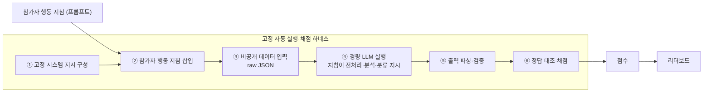

# 개발자 작업 지시서 — 자동채점 & 리더보드 구현

> **목적.** `competition_design_brief.md`(무엇을)와 `system_functional_spec.md`(어떤 구조)를 받아,
> **개발팀이 바로 구현**할 수 있도록 자동채점 엔진과 리더보드를 의사코드·API·비용·티켓 수준으로 구체화한다.
> 대상: 데이원컴퍼니 플랫폼 개발팀.
>
> **한 줄 요약.** 참가자는 데이터 분석 강의에서 배운 사고 과정을 바탕으로 **프롬프트(행동 지침)**를 작성하고,
> 하네스는 그 지침을 **지정된 경량 LLM 모델**에 재실행해 숨겨진 비공개 데이터로 채점한다. 채점 결과는 제출 후 **통상 수 분 내, 최대 15분 내** 리더보드에 반영한다.

---

## 0. 구현 전 확인사항 (주최측 결정 · 착수 전 고정)

아래 항목은 미확정 상태이며, 구현 착수 전 확정해야 이후 스키마·산식·UI가 흔들리지 않는다(→ `competition_design_brief.md` §0·§7).

- **최종 하네스 형태:** Shape A(단일 행동 지침) vs Shape B(단계별 다중 프롬프트) — 채택안에 따라 제출 스키마·모델 호출 구조·채점 파이프라인·UI가 모두 달라짐
- **최종 채점 모델** (경량 모델 후보 중 파일럿 후 확정)
- **private 채점셋 행 수** (설명용 Public 300 / Private 700 → 운영 시 확장 검토)
- **리더보드 점수 / 토탈 점수 배점** (분리 구조의 각 항목 정확 배점)
- **프롬프트 효율성 반영 방식** (보조 지표 vs 동점 처리 vs 소배점)
- **미리보기·공식 제출 횟수** (샘플 실행 ~50/일 · 공식 3/일)
- **리더보드 공개 정책** (구간 공개 → 실등수 → 최종 Private 전환 시점)

---

## 1. 채점 모델 정책

| 용도 | 모델 | 파라미터 |
|---|---|---|
| **공식 채점** | **미확정** — 경량 모델 우선 검토하되 후보별 실측 필수(`gpt-4o-mini`는 실측 후 제외 권고) | `temperature=0` · `seed` 고정(예: 42) · 작은 `max_output_tokens` · tools 없음 |
| **미리보기** | 공식 채점과 **동일 모델** 권장 | 공식 채점과 최대한 동일 |
| **개발/테스트** | LLM 경계(HTTP 호출)를 고정 응답 스텁으로 대체 | 회귀 테스트·비용 절감용 (별도 mock 모델 경로 없음) |

- 실제 운영 모델은 **비용·응답 속도·출력 안정성·파싱 성공률**을 기준으로 최종 확정한다.
- ⚠️ **모델이 점수 천장을 결정한다(실측).** 동일 규칙 인코딩 프롬프트가 `gpt-5.4-nano` ≈35 / `gpt-5.4-mini` ≈54 / `gpt-5.4` ≈80. 소형·`max_tokens=50`·정답-only에서는 완벽한 규칙을 줘도 다분기 실행이 안 돼 상한이 낮다 → 대회 변별력을 위해선 모델 급을 함께 결정해야 한다(참고 프롬프트·실측 → `reference_prompts.md`).
- ⚠️ **`gpt-4o-mini`는 채택 불가 수준(실측).** 결합 F1 0.1766으로 다수클래스 상수 예측(0.1711)과 구별되지 않으며, 조잡한 422자 프롬프트(0.3102)가 정교한 650자를 역전해 **점수가 프롬프트 품질과 역상관**한다. 모델명의 `mini`/`nano` 표기로 성능을 유추하지 말 것(`gpt-4o-mini` 0.1766 vs `gpt-5.4-mini` 0.54).
- ✅ **`gpt-4.1-nano`가 현재까지 최선의 후보(실측).** ≈80점 프롬프트 0.3131(리더보드 36.01)로 규칙 프롬프트 간 순서가 보존되고 `cycle` 4개 클래스를 모두 예측한다. 변별 구간은 0.1711~0.31로 좁다.
- ⚠️ **출력 절단이 프롬프트 품질 사다리를 깨뜨린다(실측).** 도메인 추론을 유도하는 822자 지침이 211자 지침보다 낮게 나온다(0.1738 < 0.2337) — INVALID 151행이 전부 69~91자에서 절단됐다.
- ✅ **처방: `max_tokens` 상향이 아니라 고정 시스템 지시(실측).** 캡 200 상향은 실패(0.1813, 남은 INVALID 119/119가 다시 캡에서 절단). 반면 "추론 과정 금지·한 줄만 출력" 고정 문장을 덧붙이면 **캡 50 그대로** INVALID 0.5033 → 0.0267, F1 0.1738 → 0.2741이 되고 **P0 < P1 < P2 단조 증가가 회복**된다. → **6단계 하네스의 1단계 "고정 시스템 지시 구성"을 실제로 구현할 것**(→ `reference_prompts.md`).
- ⚠️ **실패 셀이 오답으로 계상된다(공정성).** 재시도 소진 셀은 `ERROR`로 오답 처리되고 5% 중단 임계 아래면 실행이 완주한다. 참가자가 일시적 API 오류로 점수를 잃고도 알 수 없으므로 **실패 셀 재시도** 또는 **제출 상세에 실패 셀 수 노출**이 필요하다.
- 모델은 config 값(`SCORING_MODEL`)으로 관리하고 **코드에 하드코딩하지 않는다**. 후보 승급 검토 시 반드시 `public` 300행 실측으로 변별력을 확인한다.
- 모든 참가자의 공식 제출은 **동일 모델·동일 파라미터·동일 하네스** 조건에서 실행한다.
- 채점 시점의 **모델명·모델 버전·파라미터·`score_version`**을 저장한다.
- **리즈닝 억제(7/5 미팅):** non-reasoning 소형 모델 + **정답-only 출력 강제** → 작은 출력 토큰 캡과 정합(추론 텍스트로 잘림 방지).
- LLM 특성상 **완전한 결정론을 보장하기 어렵다** → 공식 제출의 **원출력·파싱 결과·점수 결과를 모두 저장**해 재현·감사 기준을 확보한다.
- **모델 단가는 변동될 수 있으므로 문서·코드에 고정하지 않는다.** 운영 전, 최종 후보 모델로 샘플 프롬프트·private 데이터·출력 형식을 사용해 **파일럿 비용을 측정**한다(계산식은 §8, §8 표는 특정 단가 가정 **예시**).

---

## 2. 시스템 개요 (프롬프트 데이터 분석 하네스)



- **참가자 = 분석 로직(지침)만.** "수리기간=종료−시작 계산 → 가동시간 정규화 → 규칙 적용" 같은 **전처리·분석을 프롬프트로** 지시. 강의(데이터 분석)에서 배운 사고를 프롬프트로 구현하는 것이 과제의 본질.
- **하네스 = 자동 실행·채점 구조.** 입력 직렬화·모델 호출·출력 파싱·정답 대조·점수 산정 방식을 고정해 모든 참가자를 동일 조건에서 평가하고 재현성을 높인다(완전한 결정론 보장이 아님). 아래 §3.
- **Shape A/B 영향:** 위 파이프라인은 **Shape A(단일 지침)** 기준이다. Shape B(단계별 다중 프롬프트) 채택 시 ②가 다노드 체인으로 확장되고 제출 스키마·파싱·채점이 함께 바뀐다(§0 · 기획서 §7).

---

## 3. 자동채점 엔진 — 구현

> ⚠️ **배점 재논의 중(7/5 미팅).** 리더보드 점수(결과값 유효성 + **프롬프트 효율성**) / 토탈 점수(+ 수강·형식·보안) **분리** · 정확 배점은 주최측 확정. 아래 5-dim 함수(신뢰성·데이터활용 등)는 참고 골격이며, **프롬프트 효율성 함수**(글자·토큰 기반, 잠정)를 리더보드 점수에 복원한다. 골드셋(§6)은 배점 확정 시 재계산.

### 3.1 입력 직렬화 (고정)
각 비공개 데이터 레코드를 **raw JSON 1줄**로 직렬화. 파생값(수리기간 등)은 **만들지 않음** — 파생은 지침이 결정.
```python
def serialize(row) -> str:
    return json.dumps(row, ensure_ascii=False)   # {"id":1,"vehicle_model":"K-511","part_system":"엔진","operation_area":"전방",...}
```

### 3.2 모델 호출 (OpenAI API) — 캐싱·재시도·예산
**주입 방식(권장): system = 참가자 지침, user = 레코드.** 지침이 전체 채점 행 내내 동일하므로 **프롬프트 캐싱**으로 입력비가 급감(캐시 입력 $0.02/1M). (`{{input}}` 인라인 치환도 가능하나 캐싱 효율↓)

```python
def run_agent(instruction: str, row: dict) -> str:
    resp = openai.responses.create(
        model=SCORING_MODEL,               # config 값 (예: 경량 모델)
        temperature=0, seed=SEED, max_output_tokens=MAX_OUTPUT_TOKENS,
        input=[
            {"role": "system", "content": instruction},   # 캐시되는 안정 프리픽스
            {"role": "user",   "content": serialize(row)}, # 행마다 변하는 부분
        ],
    )
    return resp.output_text.strip()
```
- **재시도:** 429/5xx/timeout → 지수 백오프 재시도(≤3). 초과 시 제출 `FAILED` + 관리자 알림.
- **캐싱/중복 제거:** 동일 (정규화된) 지침+행 조합은 결과 재사용(`api_budget.cache_hits`).
- **예산 가드:** `api_budget` 일 상한 근접 시 신규 채점 큐 지연·경고(§8).
- **원출력 저장:** 응답 원문을 `model_runs.raw_output`에 저장(재현·감사·이의 대응).

### 3.3 출력 파싱 (고정)
```python
ALLOWED_RISK = {"HIGH","MEDIUM","LOW"}
ALLOWED_CYCLE = {"0-30","31-90","91-180","181+"}

def parse(text: str):
    # 원칙: 정답-only 출력(`risk_grade, cycle_range`)을 요구한다.
    # 예외: 설명이 붙어 온 경우 마지막 유효 라벨 줄을 파싱(개발 안정성).
    for line in reversed(text.splitlines()):
        m = re.search(r"(HIGH|MEDIUM|LOW)\s*,\s*(0-30|31-90|91-180|181\+)", line, re.I)
        if m:
            return m.group(1).upper(), m.group(2)
    return None, None   # 파싱 실패 → 무효 행
```
- 파싱 실패·허용 밖·빈값 → 해당 행 **정확도 오분류 + 유효성 감점**.

### 3.4 지표 계산

**① 정확도 — 평균 Macro F1**
```python
def macro_f1(y_true: list, y_pred: list, labels: set) -> float:
    f1s = []
    for c in labels:
        tp = sum(t==c and p==c for t,p in zip(y_true,y_pred))
        fp = sum(t!=c and p==c for t,p in zip(y_true,y_pred))
        fn = sum(t==c and p!=c for t,p in zip(y_true,y_pred))
        prec = tp/(tp+fp) if tp+fp else 0.0
        rec  = tp/(tp+fn) if tp+fn else 0.0
        f1s.append(2*prec*rec/(prec+rec) if prec+rec else 0.0)
    return sum(f1s)/len(f1s)

avg_f1 = (macro_f1(risk_true, risk_pred, ALLOWED_RISK)
        + macro_f1(cycle_true, cycle_pred, ALLOWED_CYCLE)) / 2   # 0~1
```
> 순서형 `cycle_range`는 Macro F1(A·기본). QWK(B)로 바꿀 경우 `sklearn.metrics.cohen_kappa_score(..., weights="quadratic")`, 음수는 0 클리핑. (기획서 §7)

**② 결과 신뢰성(25) — 정답 없이 판정**
```python
def reliability(preds) -> float:                  # preds = [(risk, cycle), ...] 채점 행 수만큼
    # ⓐ 분포 건전성: 어느 한 라벨도 임계(잠정 0.8) 초과 점유 금지
    dom = max(label_share(preds))                 # 최다 라벨 점유율
    dist_health = 1.0 if dom <= 0.8 else max(0.0, (1 - dom)/0.2)
    # ⓑ 논리 정합성: risk↔cycle 조합이 §1.3 상관과 모순되지 않는 비율
    consistent = mean(is_consistent(r, c) for r, c in preds)  # HIGH↔0-30, MEDIUM↔{31-90,91-180}, LOW↔181+
    return 25 * (0.5*dist_health + 0.5*consistent)            # 가중 잠정 §협의
```

**③ 데이터 활용역량(20) — 다양성·분포 근접**
```python
def data_util(preds, gt) -> float:
    diversity = entropy(label_dist(preds)) / entropy_uniform       # 클래스 다양성 0~1
    closeness = 1 - js_divergence(label_dist(preds), label_dist(gt))  # 정답 분포 근접
    return 20 * (0.5*diversity + 0.5*closeness)                    # 가중 잠정 §협의
```

**④ 커버리지(10)/제출규격(5)**
```python
coverage = 10 * (covered_rows / total_rows)       # 유효 예측(빠짐·빈값 0) 비율
format_  = 5 * (contract_rows / total_rows)        # 출력 계약(한 줄·콤마·허용 라벨) 준수 비율
```

**게이트 (점수 밖):** 수강률(VOD 미충족 → 제출 차단) · 보안(`no_forbidden` 위반 → `review_flag` + 실격). 정규식: 주민번호·전화·실명·군보안·금지어. 점수화하지 않음.

### 3.5 통합 산식 — 참고 산식 / 권장 산식 (배점 미확정)

> ⚠️ 아래 배점·가중은 **미확정**이다(주최측 확정). IITP 참고 산식과 7/5 리더보드/토탈 분리 권장 산식을 함께 제시한다.

**참고 산식 — IITP 5개 항목 기준**
```python
reference_total = (
    40 * avg_f1
    + 25 * reliability_score
    + 20 * data_utilization_score
    + 10 * coverage_score
    + 5  * format_score
)   # 수강률·보안은 게이트(점수 밖)
```

**권장 산식 — 리더보드 / 토탈 분리** (가중 W_*는 미확정)
```python
leaderboard_score = (
    W_PRED  * avg_f1
    + W_EFF * prompt_efficiency_score
)
total_score = (
    leaderboard_score
    + W_VOD      * vod_score
    + W_FORMAT   * format_score
    + W_SECURITY * security_score
)
# 단, 수강률·보안은 점수화하지 않고 게이트로 둘 수도 있다(주최측 확정).
```

**프롬프트 효율성 (잠정)**
```python
def prompt_efficiency(chars: int, c_min=300, c_max=3000) -> float:
    if chars > c_max:
        return 0.0
    return max(0.0, min(1.0, (c_max - chars) / (c_max - c_min)))
```
> 프롬프트 효율성은 **결과 성능이 일정 수준 이상일 때만 보조 지표**로 반영하거나 **동점 처리 기준**으로 사용하는 것을 권장한다. 지나치게 짧은 프롬프트를 유도하지 않도록 **배점은 작게** 유지한다(열린 결정 ③).

### 3.6 end-to-end 의사코드
```python
def score_submission(sub):
    inst = sub.instruction
    if not vod_ok(sub.participant): reject(sub, "수강 미충족"); return   # 게이트
    # 프로토타입: 행당 1회 호출 / 운영: 미니배치(10행)로 교체
    runs, preds = [], []
    for batch in make_batches(PRIVATE_ROWS, size=BATCH_SIZE):   # BATCH_SIZE=1(프로토타입)~10(운영 미니배치)
        raw = run_agent(inst, batch)
        runs.append(raw); preds.extend(parse_batch(raw))       # 배치 파싱
    save_model_runs(sub.id, PRIVATE_ROWS, runs, preds)
    if has_forbidden(inst, runs): flag(sub, "SECURITY")     # 게이트: 실격 후보
    # Public/Private 분리 채점
    for split in ("PUBLIC","PRIVATE"):
        gt = ground_truth(split)                            # Public 300 / Private 700행
        avg_f1 = mean_macro_f1(preds, gt)
        total = 40*avg_f1 + reliability(preds) + data_util(preds, gt) + coverage(preds) + format_(preds)
        ...
    save_scores(sub.id, ...); mark(sub, "SCORED")
```
- **호출 단위:** 프로토타입은 **행당 1회**로 구현해도 되지만, 1만 명 규모에서는 비용·처리량 리스크가 크므로 **운영에서는 10행 미니배치 또는 대량 일괄 호출을 반드시 비교**한다(§8·기획서 §7.1). 일괄 호출은 일부 행 파싱 실패 시 해당 행만 무효 처리하거나 배치 재시도.
- **멱등:** 동일 제출 재채점 = 저장된 원출력 기준 동일 점수(원출력 재사용). 재채점은 overwrite + `audit_log`.

---

## 4. 리더보드 — 구현 (점수 반영 = 수 분 내 · 공개 수준 전환 = 배치)

> **점수 반영과 공개 정책 전환을 분리한다.** 채점 완료 후 리더보드 **점수**는 통상 수 분 내(최대 15분 내) 갱신한다. 단, **공개 수준 전환**(구간 공개 → 실제 등수 공개 → 최종 Private 순위 확정)은 운영 정책에 따라 배치 작업으로 처리할 수 있다.

```python
def update_leaderboard(at):                                 # 점수 반영: 제출 후 수 분 내 (7/5 미팅)
    rows = []
    for p in participants_with_scored_submissions():
        best = max(p.submissions, key=lambda s: s.total_public)   # 최고점 자동 선택
        rows.append((p.id, best.id, best.total_public))
    rows.sort(key=lambda r: (-r[2], tiebreak(r)))           # 동점: 예측 성능 → Private Test → 최초 제출 시간
    N = len(rows)
    for rank, (pid, sid, total) in enumerate(rows, 1):
        pct  = round(100*rank/N, 1)                         # 상위 백분위
        tier = "상위" if pct<=33 else "중위" if pct<=66 else "하위"
        upsert_snapshot(snapshot_at, pid, sid, total, rank, tier, pct, submit_count)
    swap_public_table()                                     # 무중단 교체(실패 시 직전 유지)
```
- **단계적 공개(§6 명세):** 초반=구간만 / 진행중=주기적 갱신 / 마지막날=실등수 / 마감후=**Private 재채점**. (점수 반영은 상시 수 분 내, 공개 수준 전환만 배치)
- **본인 뷰:** `percentile` + 점수 분포 히스토그램(버킷 카운트) + 본인 버킷 강조.
- 최종 순위 = 마감 후 `total_private` 재정렬.

---

## 5. DB 스키마 (핵심 — 명세서 §4 발췌)

| 테이블 | 주요 필드 | 목적 |
|---|---|---|
| `submissions` | id, participant_id, problem_id, instruction_json, instruction_chars, status | 공식 제출 저장 |
| `scoring_jobs` | submission_id, status, attempts, error_message | 비동기 채점 작업(큐) |
| `model_runs` | submission_id, row_id, raw_output(URI), parsed_risk, parsed_cycle | LLM 실행 원출력·파싱 결과 |
| `scores` | f1_risk, f1_cycle, avg_f1_public/private, reliability, data_util, coverage, format, leaderboard_score, total_public/private, **score_version** | 점수 저장(배점 버전 구분) |
| `ground_truth` | risk_grade, cycle_range, split(PUBLIC/PRIVATE) | 정답셋(워커 격리) · Public 300 / Private 700 |
| `leaderboard_snapshots` | rank, tier, percentile, submit_count, snapshot_at | 리더보드 표시 |
| `api_budget` | date, model, calls, cost, cache_hits | 비용·예산 통제 |
| `review_flags` · `audit_log` | 검수 플래그 · 재채점/변경 이력 | 부정·감사 대응 |

- `score_version`으로 배점 변경 전후 점수를 구분한다. 수강률·보안은 점수화하지 않고 **게이트 플래그**로 둘 수 있다(주최측 확정).

---

## 6. 회귀 골드셋 (반드시 먼저 구현·고정)
채점 엔진을 만들기 전에 **오프라인 회귀 테스트**로 기대값을 못박는다.

| 케이스 | 지침 | 기대 (예측·신뢰·활용·커버·규격 = 총점) |
|---|---|---|
| A. 정확·건전 | 정답 규칙을 정확히 담음 | avg_f1 0.90 → 36 · 25 · 20 · 10 · 5 = **96.0** |
| B. 그럴듯하나 오답 | 형식·분포 양호, 규칙 절반 | avg_f1 0.30 → 12 · 25 · 18 · 10 · 5 = **70.0** |
| C. 계약 이탈·저커버리지 | 문장으로만 답·다수 파싱 실패 | avg_f1 0.15 → 6 · 8 · 5 · 4 · 2 = **25.0** |
| 단일 라벨 남발 | 전행 동일 라벨 | 신뢰성 분포 건전성 0점대 · 데이터활용 다양성 0 |
| 보안 위반(게이트) | 금지 표현 포함 | `review_flag` + 실격 (점수 밖) |
| input 슬롯 누락 | `{{input}}` 없음 | 제출 반려(횟수 미차감) |
| 3000자 초과 | 지침 길이 초과 | 제출 반려 |
| LLM timeout | API 실패(≤3 재시도 후) | `FAILED` 처리 + 관리자 알림 |
| 재채점 | 저장 원출력 기준 재계산 | 동일 점수(멱등) |
| 동점 처리 | 동일 점수 2명 | 예측 성능 → Private → 최초 제출 순 (효율성 반영은 배점 확정 시) |
| batch 파싱 실패 | 일부 행 누락 | 누락 행만 무효 또는 배치 재시도 |
- **재현성 테스트:** 온도0으로 동일 지침 10회 실행 → 점수 변동 폭 측정, 허용 오차 확정. 초과 시 **행당 k=3 다수결** 도입.

---

## 7. 작업 분해 (마일스톤 · 완료조건)

| # | 작업 | 완료조건(AC) |
|---|---|---|
| M1 | **데이터·정답셋 생성** (sample 10 / Public 300 / Private 700 / ground_truth, 규칙 스크립트) | 규칙 재실행 시 동일 정답 재현 · 라벨 분포 확인 |
| M2 | **채점 엔진(오프라인)** — §3 전체 | 골드셋 5케이스 기대 총점 일치(회귀 통과) |
| M3 | **모델 연동** — OpenAI API·캐싱·재시도·예산 | 1제출(Public 300 / Private 700) 채점 시간 측정 · 캐시 적중률 로깅 |
| M4 | **제출 서비스** — 스키마·3000자·1일3회·큐 | 잘못된 제출 정확 반려(횟수 미차감) |
| M5 | **미리보기** — 샘플 데이터 10행·1일50회 rate limit | 비공개 데이터 미접근 검증 · 캐시 동작 |
| M6 | **리더보드** — §4 | 스냅샷·백분위·본인뷰 · 점수 반영 수 분 내 · 공개 수준 전환 배치 |
| M7 | **관리자 콘솔** — 현황·검수·재채점·API 예산·엑셀 | model_runs 열람·재채점 멱등 |
| M8 | **부하·비용·파일럿** | 예상 동시 500 부하 · 일 예산 시뮬 · 내부 전과정 리허설 |

---

## 8. 비용 추정 & 통제

> ⚠️ **아래 비용표는 특정 모델 단가를 가정한 예시**이며, 실제 운영 전 **최종 후보 모델의 최신 단가로 재계산**한다. 단가는 문서·코드에 고정하지 않는다(§1).

**가정(예시):** 호출당 입력 ~800토큰·출력 ~100토큰, 입력 $0.10/1M·출력 $0.40/1M 가정. 캐싱·중복 제거 **미적용 상한**.

| 항목 | 호출/일(최악) | 입력비 | 출력비 | 일 합계(최악) |
|---|---|---|---|---|
| 공식 채점 (1만×3×1000행) | 30,000,000 | 24,000M×$0.10=$2,400 | 3,000M×$0.40=$1,200 | **$3,600/일** |
| 미리보기 (1만×50×10행) | 5,000,000 | 4,000M×$0.10=$400 | 500M×$0.40=$200 | **$600/일** |

- **이는 "모두가 매일 상한까지" 최악치.** 실제는 참여 곡선상 훨씬 낮음.
- **비용 통제 (필수):**
  1. **프롬프트 캐싱** — system=지침 고정 → 첫 호출 외 대부분 캐시 입력($0.02/1M). 입력비 **~60–80%↓**.
  2. **동일 지침 중복 제거** — 미리보기·재제출 캐시 재사용.
  3. **미리보기 억제** — 샘플 10행·1일 50회 rate limit·일 예산 상한.
  4. **행당 1회**(분산 크면 k=3, 비용 3×).
- 캐싱 적용 시 공식 채점 실질 **~$1,700–2,200/일 이하**로 추정. 대회 기간(약 1개월) 총액은 **일 예산 상한**으로 확정.

> **협의:** 예상 참여율(동시성 곡선)·일 예산 상한·미리보기 횟수(50 유지 여부)를 정하면 총 비용이 확정된다.

---

## 9. 재채점 정책 (멱등·감사)

- 기본 재채점은 **저장된 원출력(`model_runs`) 기준으로 점수만 재계산**한다(모델 재호출 없음 → 멱등).
- **모델 재호출 재채점**(배점·모델 변경 등)은 관리자 승인 후 별도로 수행한다.
- 모든 재채점은 `audit_log`에 남긴다.
- **`score_version`을 저장**해 배점 변경 전후 점수를 구분한다.

---

## 10. 개발팀 핵심 주의사항

1. **예측 파일 제출 대회가 아니라 프롬프트 재실행 채점 대회**다.
2. **private 데이터·`ground_truth`·API 키는 프론트/API에 절대 노출하지 않는다**(채점 워커 격리).
3. 웹 요청 처리 안에서 LLM 전체 채점을 수행하지 않는다(큐+워커 비동기).
4. **원출력·파싱 결과·점수·`score_version`을 모두 저장**한다(재현·감사·이의 대응).
5. **배점과 모델은 설정화**(config)하고 코드에 하드코딩하지 않는다.
6. **리더보드 점수와 토탈 점수는 분리 가능하게** 설계한다(효율성·수강·형식·보안 가중 교체 가능).
