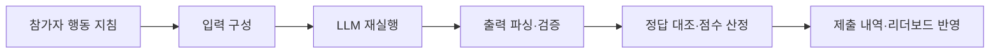
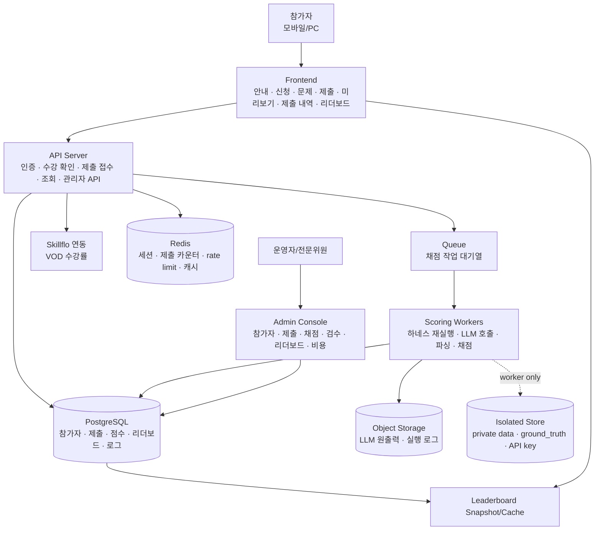
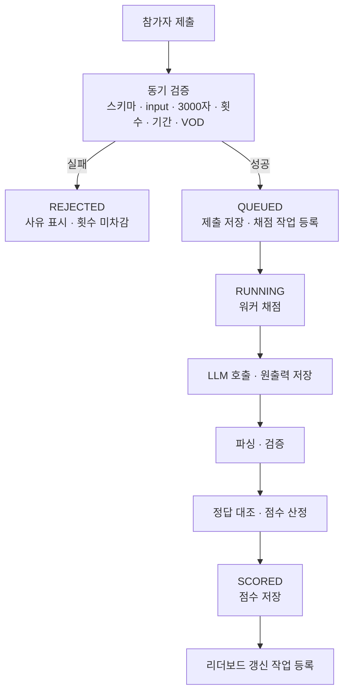
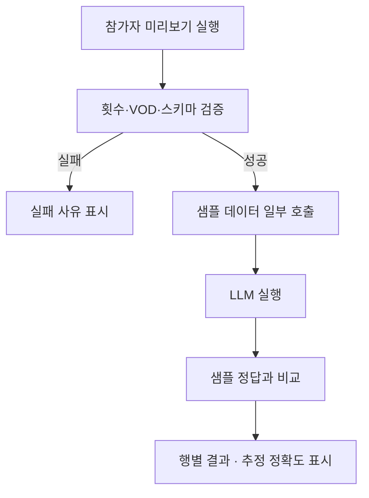
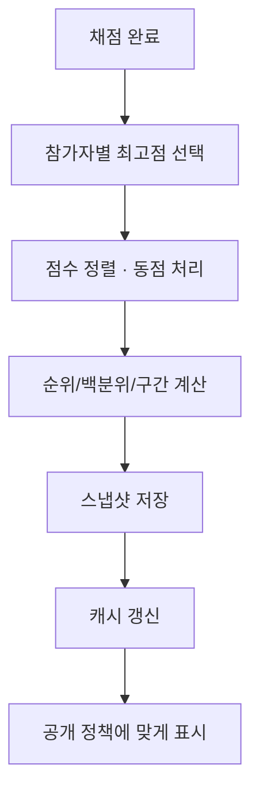
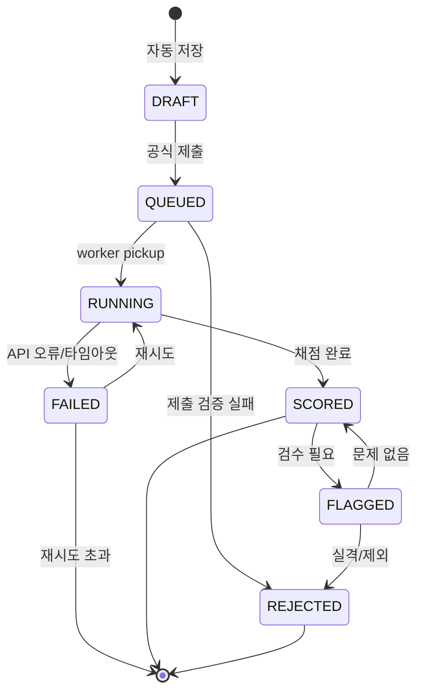

# 시스템 구조 & 기능 명세서 — 개발자 전달용

> **문서 성격.** 본 문서는 「2026 국방AI 프롬프트 경진대회」 플랫폼을 구현하기 위한 **기능 명세서**다.  
> `competition_design_brief.md`가 “무엇을 평가할 것인가(WHAT)”를 정의하고, `dev_architecture_plan.md`가 “어떤 인프라 구조로 운영할 것인가(INFRA)”를 설명한다면, 본 문서는 개발사가 구현해야 할 **화면·기능·상태·데이터 흐름(HOW/FUNCTION)**을 정리한다.
>
> **중요:** 본 문서는 개발 확정 명세가 아니라, 자문단 기준의 기능 설계안이다. 최종 기능 범위는 미송님 및 주최측 확인 후 확정한다. 특히 배점, 모델, 하네스 형태(Shape A/B), private 데이터 행 수, 리더보드 공개 정책은 아직 확정 전제로 두지 않는다.

---

## 0. 상위 결정 사항

아래 항목은 기능 구현 범위에 직접 영향을 준다. 개발 착수 전 우선 확인이 필요하다.

| 결정 항목 | 기능에 미치는 영향 | 현재 권장안 |
|---|---|---|
| 대회 의도 | 난이도, UI 안내, LLM 도우미 범위 | 초급자 경험 제공 + 기본 경쟁 혼합 |
| 문제 수 | 문제 목록, 점수 합산, 리더보드 구조 | 일부 선택 + 문제별 배점 검토 |
| 제출 형태 | 제출 UI, DB 스키마, 채점 하네스 | Shape A 기준, Shape B 수용 가능 구조 |
| 점수 구조 | scores 테이블, 리더보드 표시, 최종 심사 | 리더보드 점수 / 토탈 점수 분리 |
| 채점 모델 | 비용, 처리 속도, 원출력 저장 | 경량 모델 우선 검토 |
| 리더보드 정책 | 실시간 갱신, 구간 공개, 최종 공개 | 통상 수 분 내, 최대 15분 내 반영 |

---

## 1. 핵심 리프레임

본 대회는 일반적인 파일 제출형 데이터 분석 대회가 아니다.

참가자는 `submission.csv`나 예측 결과 파일을 제출하지 않는다.  
참가자는 LLM이 데이터를 어떻게 읽고 판단해야 하는지 설명하는 **행동 지침 프롬프트**를 제출한다.

시스템은 해당 프롬프트를 비공개 데이터에 대해 동일한 방식으로 재실행하고, LLM 출력 결과를 파싱해 정답과 비교하여 점수를 산정한다.

### 1.1 우리 대회의 차이

| 구분 | 일반 DACON/AIfactory형 | 본 대회 |
|---|---|---|
| 참가자 제출물 | 예측 파일 | 행동 지침 프롬프트 |
| 채점 방식 | 파일과 정답 비교 | 프롬프트 재실행 후 출력 비교 |
| 데이터 접근 | 참가자가 테스트 입력 일부 접근 가능 | private 데이터는 서버에서만 사용 |
| 핵심 역량 | 모델링/코딩/분석 | LLM 지시 설계와 데이터 해석 |
| 운영 리스크 | 제출 형식 오류 | LLM 비용, 파싱 실패, 비결정성 |
| 보안 핵심 | 정답셋 비공개 | 정답셋 + private 데이터 + API 키 격리 |

### 1.2 자동 실행·채점 하네스

본 문서에서 “하네스”는 다음 흐름을 고정하는 자동 실행·채점 구조를 의미한다.



하네스가 고정하는 것은 입력 형식, 모델 호출 방식, 출력 계약, 파싱 규칙, 채점 산식이다.  
분석 판단 자체는 참가자가 작성한 행동 지침에 의해 수행된다.

---

## 2. 전체 시스템 구조



### 2.1 핵심 원칙

1. 웹 접수와 채점 실행을 분리한다.
2. 채점은 Queue + Worker 기반으로 비동기 처리한다.
3. private 데이터, ground_truth, API 키는 워커에서만 접근한다.
4. 모든 공식 제출의 원출력, 파싱 결과, 점수, score_version을 저장한다.
5. 리더보드는 캐시/스냅샷 기반으로 제공한다.
6. 참가자 화면은 모바일 우선과 세션 지속을 고려한다.
7. 관리자 화면은 재채점, 검수, 비용 모니터링을 포함한다.

---

## 3. 사용자 유형

| 사용자 | 주요 목적 | 필요 기능 |
|---|---|---|
| 참가자 | VOD 수강 후 문제 풀이, 프롬프트 제출, 점수 확인 | 신청, 수강률 확인, 문제 열람, 미리보기, 제출, 제출 내역, 리더보드 |
| 운영자 | 참가자·제출·채점·리더보드 운영 | 현황 조회, 재채점, 검수, 공개 전환, 엑셀 다운로드 |
| 전문위원 | 상위권 검토, 부정행위 판단, 수상 후보 검수 | 제출 원문, 원출력, 점수, 플래그 검토 |
| 개발/관리자 | 시스템 상태와 비용 관리 | 큐 상태, API 비용, 에러 로그, 배치 상태 |

---

## 4. 기능 명세

## 4.1 참가자 포털

### 목적

참가자가 대회 개요를 이해하고, 신청 및 수강 후 문제에 접근할 수 있도록 한다.

### 기능

- 대회 개요
- 참가 대상
- 일정
- 참가 방법
- VOD 수강 조건
- 문제/제출 방식 안내
- 평가 및 시상 안내
- 유의사항
- 신청 버튼
- 로그인 상태별 CTA

### 상태

| 상태 | 화면 처리 |
|---|---|
| 비로그인 | 로그인/신청 유도 |
| 신청 전 | 신청 버튼 표시 |
| 신청 완료 · 수강 전 | VOD 수강 안내 |
| 수강 조건 충족 | 문제 열람 및 제출 가능 |
| 대회 마감 | 제출 비활성화, 결과 확인만 가능 |

---

## 4.2 신청·인증

### 입력 항목

- 이름
- 이메일
- 휴대폰
- 소속
- 계급/직책
- 구글 계정
- 개인정보 동의
- 운영규정 동의

### 검증

- 이메일 또는 구글 계정 중복 방지
- 필수 항목 누락 방지
- 동의 항목 미체크 시 신청 불가

### 관리자 기능

- 참가자 목록 조회
- 이름/소속/계급 검색
- 신청 상태 필터
- 엑셀 다운로드
- 계정 수동 수정 또는 비활성화

---

## 4.3 VOD 수강 게이트

### 목적

대회 참여 전 최소 학습 조건을 확인한다.

### 정책

- 필수 VOD 3개 각각 30% 이상 수강 시 문제 열람 및 제출 가능
- 수강률 미충족 시 제출 버튼 비활성화
- 서버에서도 제출 차단

### 연동 방식

- Skillflo API 실시간 조회
- 또는 주기 동기화 배치
- 동기화 실패 시 마지막 동기화 시각 표시

### 예외 처리

| 상황 | 처리 |
|---|---|
| 수강률 조회 실패 | 잠시 후 재시도 안내 |
| 수강률 미충족 | VOD 수강 화면으로 유도 |
| 수강률 충족 후 반영 지연 | 수동 새로고침 또는 관리자 확인 |
| 계정 불일치 | 구글 계정 확인 안내 |

---

## 4.4 문제/데이터 배포

### 공개 데이터

- `problem_description.md`
- `sample.csv`
- `sample_prompt.json`
- 컬럼 설명
- 출력 형식
- 평가 방식 안내
- FAQ
- 보안 유의사항

### 비공개 데이터

- `private.csv`
- `ground_truth`
- Public/Private split 정보

비공개 데이터와 정답셋은 참가자, 프론트엔드, 일반 API 서버에 노출하지 않는다.  
채점 워커만 접근한다.

### 권한

| 사용자 | 접근 가능 |
|---|---|
| 미신청자 | 대회 안내 |
| 신청자 · 수강 미충족 | VOD 안내 |
| 수강 충족자 | 문제·샘플 데이터 |
| 워커 | private 데이터·ground_truth |
| 관리자 | 제출/점수/로그 조회, ground_truth 직접 열람은 제한 권장 |

---

## 4.5 프롬프트 제출 서비스

### 제출물

참가자는 예측 파일이 아니라 행동 지침 JSON을 제출한다.

```json
{
  "instruction": "너는 국방 설비 정비 분석가다. 입력 데이터를 보고 risk_grade와 cycle_range를 판단하라. 입력: {{input}} 출력: HIGH, 0-30 형식으로만 답하라.",
  "memo": "선택: 접근 방식 요약"
}
```

### 동기 검증

큐에 넣기 전에 아래를 검증한다.

| 검증 항목 | 실패 시 |
|---|---|
| JSON 스키마 | 반려, 횟수 미차감 |
| `instruction` 존재 | 반려, 횟수 미차감 |
| `{{input}}` 포함 | 반려, 횟수 미차감 |
| 3000자 이하 | 반려, 횟수 미차감 |
| 1일 제출 3회 이하 | 반려 |
| 대회 기간 내 제출 | 반려 |
| VOD 게이트 통과 | 반려 |
| 금지어/개인정보 1차 탐지 | review_flag 또는 반려 정책 선택 |

### 제출 상태

| 상태 | 의미 |
|---|---|
| `DRAFT` | 작성 중 자동 저장 상태 |
| `QUEUED` | 제출 접수, 채점 대기 |
| `RUNNING` | 워커가 채점 중 |
| `SCORED` | 채점 완료 |
| `FAILED` | API 오류, 타임아웃 등으로 실패 |
| `REJECTED` | 제출 전 검증 실패 |
| `FLAGGED` | 보안/부정행위 검토 필요 |

### 참가자 화면

- 프롬프트 작성 영역
- 글자 수 카운터 / 3000자 제한
- 자동 저장
- 미리보기 잔여 횟수
- 공식 제출 잔여 횟수
- 제출 버튼
- 제출 내역
- 채점 상태
- 리더보드 반영 안내
- 모바일 대응

---

## 4.6 미리보기 서비스

### 목적

공식 제출 전에 참가자가 프롬프트를 샘플 데이터로 테스트할 수 있게 한다.

### 정책

- 공개 샘플 데이터 일부 행만 사용
- 비공개 데이터와 ground_truth는 사용하지 않음
- 공식 점수와 분리
- 리더보드 반영 없음
- 1일 약 50회 제한
- 동일 프롬프트/동일 샘플 반복 실행 캐싱 검토

### 출력

- 샘플 입력 요약
- 기대 정답
- LLM 출력
- 통과/실패
- 추정 정확도
- “공식 채점 결과와 다를 수 있음” 안내

---

## 4.7 LLM 질문 도우미

### 목적

초급 참가자가 VOD 개념, 데이터 컬럼, 평가 지표, 출력 형식을 이해할 수 있도록 돕는다.

### 허용 질문 예시

- “Macro F1이 무엇인가요?”
- “정비횟수와 가동시간은 어떤 의미인가요?”
- “출력 형식을 지키려면 어떻게 써야 하나요?”
- “프롬프트를 작성할 때 어떤 순서로 생각하면 좋나요?”

### 제한 질문 예시

- “정답 프롬프트를 작성해줘”
- “private 데이터에서 HIGH 조건을 알려줘”
- “내 점수를 가장 높이는 프롬프트를 대신 만들어줘”
- “실제 부대 정비 데이터를 입력해도 되나요?”
- 대회와 무관한 일반 질문

### 기능

- 질문/응답 로그 저장
- 토큰 사용량 기록
- 사용자별 호출 제한
- 금지어/개인정보 탐지
- 목적 외 질문 차단
- 관리자 조회 기능

### 구현 상태

LLM 질문 도우미는 초급자 친화성을 위해 권장하나, 비용과 운영 리스크가 있으므로 선택 구현으로 분류한다.  
도입 시 별도 예산과 로그 정책이 필요하다.

---

## 4.8 채점 서비스

> **주의:** 아래 산식은 참고 구조다. 최종 배점은 미송님과 주최측 확정 후 반영한다.

### 흐름

1. 제출 스키마 재검증
2. 보안 스캔
3. private 데이터 로드
4. 하네스 입력 구성
5. LLM 호출
6. 원출력 저장
7. 출력 파싱
8. ground_truth 대조
9. 점수 산정
10. scores 저장
11. 리더보드 갱신 작업 등록

### 채점 항목

- 예측 성능
- 결과 신뢰성
- 데이터 활용역량
- 커버리지
- 제출규격
- 프롬프트 효율성
- 수강률
- 보안 적합성

### 점수 구조

권장 구조는 다음과 같다.

| 점수 | 용도 | 포함 가능 항목 |
|---|---|---|
| 리더보드 점수 | 실시간 경쟁 | 예측 성능, 결과 유효성, 프롬프트 효율성 |
| 토탈 점수 | 최종 수상 | 리더보드 점수, 수강률, 제출형식, 보안 적합성 |
| 게이트 | 응시/실격 조건 | VOD 수강률, 보안 위반, 제출 규격 중대 위반 |

### 실패 처리

| 상황 | 처리 |
|---|---|
| API timeout | 재시도 |
| 429/5xx | 지수 백오프 후 재시도 |
| 재시도 초과 | `FAILED`, 관리자 알림 |
| 일부 행 파싱 실패 | 해당 행 무효 또는 감점 |
| 전체 파싱 실패 | 낮은 점수 또는 실패 정책 적용 |
| 보안 위반 | `review_flag`, 심각도에 따라 실격 검토 |

---

## 4.9 리더보드 서비스

### 목적

참가자에게 현재 성과와 위치를 제공하고, 대회 참여 동기를 유지한다.

### 리더보드 표시 항목

- 순위 또는 구간
- 참가자명 마스킹
- 소속 공개 여부
- 리더보드 점수
- 제출 횟수
- 최종 제출 시간
- 내 순위
- 내 백분위
- 점수 분포

### 공개 정책

| 시점 | 공개 방식 | 목적 |
|---|---|---|
| 초반 | 상위/중위/하위 구간만 공개 | 과열·이탈 방지 |
| 진행 중 | 통상 수 분 내, 최대 15분 내 점수 반영 | 참여 동기 유지 |
| 마지막 날 | 실제 등수 공개 | 최종 스퍼트 유도 |
| 마감 후 | Private 재채점 후 최종 순위 | 게이밍 방지 |

### 구현 원칙

- 참가자별 최고점 자동 선택
- Public 점수와 Private 점수 분리
- 최종 순위는 Private 재채점 기준
- 리더보드 조회는 캐시/스냅샷 사용
- 공개 정책은 관리자 화면에서 전환 가능
- 점수 반영과 공개 수준 전환은 분리한다

---

## 4.10 관리자 콘솔

### 주요 기능

| 기능 | 설명 |
|---|---|
| 현황 대시보드 | 신청자, 수강 충족자, 제출자, 채점 완료, 검토 필요 건수 |
| 참가자 관리 | 검색, 필터, 수강률, 제출 횟수, 최종 점수 |
| 제출 관리 | 프롬프트, 메모, 상태, 원출력, 파싱 결과, 점수 조회 |
| 재채점 | 저장 원출력 기준 재계산, 모델 재호출 재채점 |
| 리더보드 관리 | 구간/순위 공개 전환, 특정 제출 제외, 최종 스냅샷 생성 |
| 검수 | 보안, 유사 프롬프트, 산식 악용, 금지어 플래그 검토 |
| 비용 모니터링 | 모델 호출 수, 토큰 사용량, 예상 비용, 캐시 적중률 |
| 다운로드 | 참가자, 제출, 점수, 리더보드, 검수 결과 엑셀 |
| 감사 로그 | 관리자 조작, 재채점, 공개 전환 기록 |

---

## 5. 데이터 모델

| 테이블 | 핵심 컬럼 | 비고 |
|---|---|---|
| `participants` | id, name, email, phone, unit, rank_title, google_account, agree_privacy, agree_rules, created_at | 신청자 |
| `vod_progress` | participant_id, content_id, progress_pct, synced_at | Skillflo 동기화 |
| `problems` | id, competition_id, title, schema_json, output_contract, scoring_config | 다문제 확장 |
| `submissions` | id, participant_id, problem_id, instruction_json, instruction_chars, memo, status, submitted_at | 공식 제출 |
| `drafts` | participant_id, problem_id, instruction_text, updated_at | 자동 저장 |
| `preview_runs` | participant_id, problem_id, instruction_hash, result_json, created_at | 미리보기 |
| `scoring_jobs` | submission_id, status, attempts, error_message, started_at, finished_at | 큐 작업 |
| `model_runs` | submission_id, row_id, raw_output_uri, parsed_output_json, latency_ms, input_tokens, output_tokens | 원출력은 Object Storage 권장 |
| `scores` | submission_id, avg_f1_public, avg_f1_private, prediction_score, prompt_efficiency_score, leaderboard_score, total_score, score_version | 점수 |
| `ground_truth` | problem_id, row_id, split, label_json | 워커 전용 접근 |
| `leaderboard_snapshots` | problem_id, participant_id, submission_id, rank, tier, percentile, score, snapshot_at, visibility_mode | 리더보드 |
| `review_flags` | submission_id, flag_type, severity, status, reviewer, memo, decided_at | 검수 |
| `api_budget` | date, model, calls, input_tokens, output_tokens, estimated_cost, cache_hits | 비용 |
| `audit_log` | actor_id, action, target_type, target_id, before, after, created_at | 감사 |

---

## 6. 주요 시퀀스

### 6.1 공식 제출 시퀀스



### 6.2 미리보기 시퀀스



### 6.3 리더보드 갱신 시퀀스



---

## 7. 엔드포인트 초안

| 메서드·경로 | 기능 | 인가 |
|---|---|---|
| `POST /apply` | 참가 신청 | 로그인 |
| `GET /me` | 내 정보 | 로그인 |
| `GET /vod/progress` | 내 수강률 | 로그인 |
| `GET /problems` | 문제 목록 | 수강 충족 |
| `GET /problems/{id}` | 문제 상세·샘플 데이터 | 수강 충족 |
| `POST /preview` | 지침 미리보기 | 수강 충족·rate limit |
| `POST /submissions` | 공식 제출 | 수강 충족·제출 가능 상태 |
| `GET /submissions/me` | 내 제출 내역 | 로그인 |
| `GET /leaderboard` | 공개 리더보드 | 공개 정책 따름 |
| `GET /leaderboard/me` | 내 순위·백분위 | 로그인 |
| `GET /admin/dashboard` | 운영 현황 | 관리자 |
| `GET /admin/participants` | 참가자 목록 | 관리자 |
| `GET /admin/submissions` | 제출 목록 | 관리자 |
| `POST /admin/rescore` | 재채점 | 관리자 |
| `POST /admin/leaderboard/visibility` | 공개 정책 변경 | 관리자 |
| `GET /admin/export/{type}` | 엑셀 다운로드 | 관리자 |

---

## 8. 상태 머신



---

## 9. QA·검수 체크리스트

### 9.1 참가자 플로우

- 신청 가능 여부
- 수강률 조회 및 제출 게이트
- 문제 열람 권한
- 프롬프트 자동 저장
- 3000자 제한
- `{{input}}` 누락 검증
- 미리보기 50회 제한
- 공식 제출 3회 제한
- 제출 내역 표시
- 모바일 화면 사용성
- 세션 중단 후 복원

### 9.2 채점 플로우

- Queue 등록
- Worker 실행
- private 데이터 접근 권한
- ground_truth 접근 권한
- LLM API timeout/429 처리
- 원출력 저장
- 파싱 실패 처리
- 점수 산정
- score_version 저장
- 재채점 멱등성
- Public/Private 분리

### 9.3 리더보드

- 최고점 자동 선택
- 동점 처리
- 구간 공개
- 실제 등수 공개
- Private 최종 재채점
- 내 백분위 표시
- 점수 분포 그래프
- 캐시 갱신 실패 복구

### 9.4 관리자/보안

- 제출 원문 조회
- 원출력 조회
- 보안 플래그 생성
- 유사 프롬프트 탐지
- 특정 제출 제외
- 재채점
- 다운로드 권한
- 감사 로그
- 실제 군사정보 입력 차단
- 개인정보 탐지

### 9.5 비용/성능

- 예상 동시 약 500명 접수
- 미리보기 폭주
- 제출 마감 직전 폭주
- 큐 적체
- 워커 장애
- API 비용 상한
- 캐시 적중률
- 리더보드 조회 부하

### 9.6 외부 QA

비개발자, 프롬프트 초급자, 데이터 분석 비전공자를 포함해 QA를 진행한다.

확인할 항목:

- 문제 설명 이해 여부
- LLM 질문 도우미의 도움 여부
- 프롬프트 작성 난이도
- 모바일 입력 불편
- 미리보기 결과 해석 가능 여부
- 제출 후 상태 이해 여부
- 리더보드 위치 이해 여부
- 정답 요청, 오프토픽, jailbreak 시도 차단 여부

---

## 10. 열린 항목

| 항목 | 현재 상태 | 결정 필요 |
|---|---|---|
| 채점 모델 | 경량 모델 우선 검토 | 실제 운영 모델 |
| 하네스 형태 | Shape A 기준, Shape B 수용 가능 | 최종 제출 형태 |
| 배점 | 리더보드/토탈 분리 권장 | 항목별 정확 배점 |
| 프롬프트 효율성 | 보조 지표 권장 | 배점 또는 동점 처리 여부 |
| private 행 수 | 30행 설명용 | 운영용 확장 여부 |
| 미리보기 | 50회/일 가정 | 최종 제한 |
| 제출 | 3회/일 가정 | 최종 제한 |
| 리더보드 | 최대 15분 내 반영 | 공개 단계/시점 |
| Skillflo 연동 | API/배치 검토 | 연동 방식 |
| LLM 도우미 | 선택 구현 | 도입 여부와 예산 |
| 관리자 권한 | 필요 | 권한 단계 정의 |
| 보관 기간 | 미정 | 원출력·로그 보관 기간 |

---

## 11. 개발자 핵심 요약

1. 본 시스템은 예측 파일 제출 대회가 아니라 **프롬프트 재실행 자동채점 대회**다.
2. 참가자는 행동 지침을 제출하고, 서버가 private 데이터에 대해 이를 재실행한다.
3. 채점은 반드시 Queue + Worker 기반 비동기로 처리한다.
4. private 데이터, ground_truth, API 키는 프론트/API에서 접근할 수 없어야 한다.
5. 모든 공식 제출의 원출력, 파싱 결과, 점수, score_version을 저장한다.
6. 리더보드 점수와 토탈 점수는 분리 가능하게 설계한다.
7. 점수 반영과 리더보드 공개 정책 전환은 분리한다.
8. 모바일 사용성, 자동 저장, 세션 지속은 군 장병 환경을 고려해 중요하다.
9. LLM 질문 도우미는 초급자에게 유용하지만 비용·로그·제한 정책이 필요하다.
10. 모델, 배점, 하네스 형태는 설정값으로 관리해 정책 변경과 재채점이 가능해야 한다.
